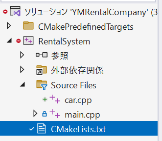

# Modern CMake for C++

## 1: First Steps with CMake

- この本の[Github](https://github.com/PacktPublishing/Modern-CMake-for-Cpp-2E/tree/main/examples)でサンプルコードを公開している
- 下記コマンドラインで、実行できる
  - `<build tree>`は出力ディレクトリパス
  - `<source tree>`はソースコードがあるディレクトリパス

```shell
cmake -B <build tree> -S <source tree>
cmake --build <build tree>
```

- CMakeの優位性
  - 現代のコンパイラーやツールチェーン(製品を製作するのに使われるプログラム（ツール）の集合体)のサポート
  - Windows、Linux、MacOS、Cygwinなどをサポートする、Cross Platform
  - Visual Studio, Xcode, Eclipseなどの統合開発環境のプロジェクトファイルを自動生成できる
  - CMakeの操作は抽象化されていて、拡張しやすい
  - CMakeで作られたプロジェクトがたくさんあり、容易に自分のアプリにPluginできる
  - CMakeはテストやパッケージング、インストールをビルドプロセスの中に統合できる
  - 古いCmakeの機能は非推奨として、メンテされている
- CMakeは3つの工程で処理が進む
  - Configuration
    - ソースディレクトリを読み、出力ディレクトリを準備する
    - Cmakeはプロジェクトが事前に設定されているか確認したり、`CMakeCache.txt`といった設定ファイルを確認する
    - 初めに、どのような環境で開発されているか、コンパイラーが有効かどうか、リンカーやアーカイバーがインストールされているか確認する
    - 次に、`CMakeList.txt`の記載内容を実行する
    - `CMakeList.txt`にはプロジェクトの構造やターゲット、依存関係などを記述する
    - この工程中に、CMakeはシステムの詳細やプロジェクト設定、ログ、Tempファイルなど次工程で必要な情報を集め、その情報を`CMakeCache.txt`として生成する
  - Generation
    - BuildSystem生成する
    - BuildSystemは、GNUのMakeファイルや、統合開発環境のための、最適な設定ファイルである
  - Building
    - 最終成果物(実行ファイルやライブラリファイル)を生成するために、Build Toolを適用する

```cmake
cmake_minimum_required(VERSION 3.26)
project(Hello)
add_executable(Hello main.cpp)
```

```shell
cmake -B ./Build
cmake --build ./Build
```

- Windows環境でこれを実行したら、自動でVisualStudio2022が選ばれて、Solutionファイルが生成され、Debugビルドがされて、Hello.exeが生成された！

```
// BuildSystemの生成
C:\YM_ProgramData\Development\GitVisualStudio\CMake> cmake -B ./Build
// VS2022が自動で選ばれる
-- Building for: Visual Studio 17 2022
-- Selecting Windows SDK version 10.0.22621.0 to target Windows 10.0.26100.
// MSVCはVisual C++
-- The C compiler identification is MSVC 19.42.34436.0
-- The CXX compiler identification is MSVC 19.42.34436.0
// CコンパイラがどのABI(アプリケーションバイナリインターフェース)を使用しているかを判断し、それをビルド設定に反映させる(Visual C++はABIをサポート)
-- Detecting C compiler ABI info
-- Detecting C compiler ABI info - done
-- Check for working C compiler: C:/Program Files/Microsoft Visual Studio/2022/Community/VC/Tools/MSVC/14.42.34433/bin/Hostx64/x64/cl.exe - skipped
-- Detecting C compile features
-- Detecting C compile features - done
-- Detecting CXX compiler ABI info
-- Detecting CXX compiler ABI info - done
-- Check for working CXX compiler: C:/Program Files/Microsoft Visual Studio/2022/Community/VC/Tools/MSVC/14.42.34433/bin/Hostx64/x64/cl.exe - skipped
-- Detecting CXX compile features
-- Detecting CXX compile features - done
-- Configuring done (7.4s)
-- Generating done (0.0s)
// Buildファイルが生成(VSではSolutionファイル？)
-- Build files have been written to: C:/YM_ProgramData/Development/GitVisualStudio/CMake/Build
```

```
// VSのProjectファイルをビルドしてくれた！
C:\YM_ProgramData\Development\GitVisualStudio\CMake> cmake --build ./Build
MSBuild のバージョン 17.12.12+1cce77968 (.NET Framework)

  1>Checking Build System
  Building Custom Rule C:/YM_ProgramData/Development/GitVisualStudio/CMake/CMakeLists.txt
  main.cpp
  Hello.vcxproj -> C:\YM_ProgramData\Development\GitVisualStudio\CMake\Build\Debug\Hello.exe
  Building Custom Rule C:/YM_ProgramData/Development/GitVisualStudio/CMake/CMakeLists.txt
```

- CMakeは5つのToolのセット
  - `cmake` : プロジェクトを設定したり、生成したりビルドをするメインの実行モジュール
  - `ctest` : テストを実行したり、テスト結果を報告したりするテストドライバー
  - `cpack` : インストーラーやソースパッケージを作ったりするパッケージングモジュール
  - `cmake-gui` : `cmake`周辺をラップするGUIツール
  - `ccmake` : `cmake`周辺をラップするコンソールベースのGUIツール

### CMakeのコマンドライン

- プロジェクトのビルドシステムの生成
  - プロジェクトをビルドするために必要な初めのステップは、ビルドシステムを作ること
  - ビルドシステムを作る方法は以下の3通りがある

```shell
// ソースとビルド結果ファイルを分けられるのでこれがオススメ
cmake [<options>] -S <source tree> -B <build tree>
```

- 本当は、対応したBuild Systemを作るために、ビルドツール(VisualStudioやXcodeやMakefile)を選ぶ必要があるが、通常は幸運なことに気にかける必要がない(CMakeが自動で選んでくれる)
- 指定するには、`CMAKE_GENERATOR`の環境変数を変更するか、下記の通り明示的にCommand実行する

```shell
cmake -G <generator name> -S <source tree> -B <build tree>
```

- VisualStudioといったいくつかのGeneratorは、Toolset(compiler)やプラットフォーム(compiler or SDK)の使用の詳細をサポートしている
- CMakeは`CMAKE_GENERATOR_TOOLSET`や`CMAKE_GENERATOR_PLATFORM`の環境変数をスキャンするが、明示的に特定のToolsetやPlatformを指定することができる

```shell
cmake -G <generator name> -T <toolset spec> -A <platform name> -S <source tree> -B <bulid tree>
```

- WindowsユーザーはIDE(VS)のビルドシステムを使いたいし、MacやLinuxユーザーはMakefileやNinjaを利用したい

```shell
// これで利用できるプラットフォームの一覧を確認できる
cmake --help
```

- CMakeはシステムの全ての種類の設定を確認し、CMakcCache.txtに保存するが、そのCacheに保存する振る舞いも設定することができる
- 私たちが自由に使える最初のオプションは、キャッシュされた情報を事前に入力する機能である。
- コマンドラインで設定する変数で大切なのは、Build Type(CMAKE_BUILD_TYPE)である
  - 1つの設定のGenerator(GNU MakeやNinja)はBuild Typeの設定が必要(DebugやReleaseやMinSizeRelやRelWithDebInfo)

```shell
cmake -S . -B ./Build -D CMAKE_BUILD_TYPE=Release
```  

- プロジェクトからBuild Treeを生成するオプションはたくさんあるが、混乱や見落としやすい。
- 開発者はプロジェクトに対してどのように相互作用するのかを設定することができ、`CMakePresets.json`でデフォルトの設定を提供することができる(16章参照)
- Build TreeをCleanする方法は下記の通り(Cleanって書いてるけど、やってみたら振る舞いがSolution/Projectファイルを再生成する振る舞いぽかった)

```shell
// Solution/Projectファイルの再生成っぽい振る舞い
cmake --fresh -S <source tree> -B <build tree>
```

- Build Treeができたら、次は実際にBuildして実行ファイルを作る！(Build方法は以下の通り)

```shell
cmake --build <build tree> [<options>] [-- <build-tool-options>]
//シンプルに
cmake --build <build tree>
```

- 並列ビルドも対応している p20
- 指定したVSのプロジェクトをビルドすることもできる

```shell
// <target>には、VSの.vsxprojファイルを指定する
cmake --build <build tree> --target <target1> --target <target2>
// --targetを-tにしてもOK
```

- Cleanする方法と、Cleanして通常ビルドする方法配下の通り

```shell
// Cleanするだけ
cmake --build <build tree> -t clean
// Cleanして通常ビルドする
cmake --build <build tree> --clean-first
```

- Releaseビルドする方法(指定しなければデフォルトはDebugビルドとなる)

```shell
// <cfg>にReleaseを指定する(ほかの文字を入れるとエラーになる)
cmake --build <build tree> --config <cfg>
// ReleaseをCleanするには
cmake --build <build tree> -t clean --config Release
```

- 実行ファイルを作る際のビルドで、コンパイラーから詳細なLog(VSと同等の出力)を出力する方法は以下の通り

```shell
cmake --build <build tree> --verbose
or
cmake --build <build tree> -v
```

- CMakeでインストールまで実行することができるが、Windows環境だとちょっと振る舞いがわからなかった。。。

```shell
cmake --install <build tree>
```

- CMakeのスクリプトを実行する方法
  - CMakeスクリプトを実行しても、CMakeの設定や生成ステージが走るわけではなく、キャッシュファイルが実行されるわけではない
  - `script.cmake`のファイル内に記述する

```shell
cmake [{-D <var>=<value>}...] -P <cmake script file> [-- <unparsed options>...]
```

```cmake
# script.cmakeの例(初めのバージョンの記述は書くことを推奨(cmakeの互換性のため))
cmake_minimum_required(VERSION 3.26.0)
message("Hello world")
file(WRITE Hello.txt "I am writing to a file")
```

- レアなケースだが、直でCMakeコマンドを実行する方法もあるが、一部のコマンドしか実行できない(詳細は、`cmake -E`を実行すと利用できるコマンドが表示される)

```shell
cmake -E <command> [<options>]
```

- `CTest`コマンドを利用すると、テストができる(詳細は11章)
- CPackコマンドラインを使うと、様々なプラットフォームに対して頒布用のモジュールを生成できる(installerやNuGetパッケージ、macOSバンドルなどなど)(詳細は１４章)

### CMakeのプロジェクトファイルやプロジェクトディレクトリについて

- Source Treeについて
  - c++ファイルや、CMakeプロジェクトファイルを格納する
    - `CMakeLists.txt`は必要
    - このフォルダのパスは`-S`で指定するので明確にすること
    - CMakeコードにこのSourceTreeの「絶対」パスをハードコーディングしないこと

- Build Treeについて
  - ビルドに必要なファイルをこのファイルに生成する(ソリューションファイルやキャッシュファイルなど)(`build root`や`binary tree`と呼ぶよ)
    - ビルドの設定ファイルなどのビルドツールが生成するファイルはここに生成されるよ
    - CMakeは、このBuildディレクトリをソースファイルとは別の場所に作ることを推奨する
    - `-B`オプションで指定するフォルダになるよ
    - このフォルダはGit登録しないほうがいいよ

- ListFileについて 
  - CMake言語を含んでいるファイルはListFileと呼び、`include()`や`find_package()`などで含めることができる。`xxx.cmake`というファイルであればよい

- Projectファイルについて(CMakeList.txt)
  - CMakeList.txtはSorceTreeの直下に置く必要があり、CMakeの実行フェーズに一番初めに実行される
  - `CMakeLists.txt`は最低限でも２つのコマンドを含める必要がある
    - `cmake_minimum_required(VERSION <x.xx>)`：CMakeの最低バージョンを記載し、過去バージョンのCMakeの振る舞いをサポートするように指示する
    - `project(<name> <OPTIONS>)`：`PROJECT_NAME`変数に格納するプロジェクトの名前を指定する。オプションについては、２章で解説
  - 開発が進むと、ソースを分けることがあるが、CMakeはCMakeLists.txtをsubフォルダ分けで管理することもサポートしている

```
myProject/CMakeList.txt
myProject/api/CMakeLists.txt
myProject/api/api.h
myProject/api/api.cpp
```

- この場合、直下のCMakeList.txtは下記のように記載すれば、apiフォルダ内のソースも含めることができる

```cmake
cmake_minimum_required(VERSION 3.26)
project(app)
message("Top level CMakeLists.txt")
add_subdirectory(api)
```

- トップレベルのCMakeList.txtは、依存関係、必須条件や開発環境を管理する
- `add_subdirectory(api)`によって、apiフォルダの中の`CMakeList.txt`を含めることができる

- Cacheファイル
  - キャッシュ変数はリストファイルから生成され、`CMakeCache.txt`に格納される
  - CMakeCache内の`EXTERNAL`はユーザーが編集してもよいが、`INTERNAL`はCMakeが管理するキャッシュ変数
  - このファイルは自身で、cmakeコマンドやGUIを利用して、編集することができる
  - CMakeCacheを消すことで、デフォルトの設定でプロジェクトをリセットすることができる

- Package定義ファイル
  - 14章(Installing and Packaging)で詳細を解説
  - Config-filesはライブラリバイナリーやヘッダーなどのヘルプツールをどのように使うかに関する情報が格納されている
  - ファイル名は、`<PackageName>-config.cmake`か`<PackageName>Config.cmake`とする
  - `find_package()`コマンドでパッケージを含める命令をする

- 生成されるファイルについて
  - 多くのファイルは生成過程でCMakeによってBuild Treeに生成されるが、それらは主導で編集すべきではない。CMakeは、CMake installアクションや、CTestやCPackの過程でその設定を利用する
    - `cmake_install.cmake`や`CTestTestfile.cmake`や`CPackConfig.cmake`を確認する

- Presetファイルについて
  - キャッシュ変数や生成器やBuild Treeなどを追加で設定する場合は、毎回主導で設定する以外に、Presetファイルを使うことで、設定が簡単になる
  - `cmake --list-presets`で現在のPresetを確認し、`cmake --preset=<preset> -S <source> -B <build tree>`でプリセットを反映することができる
  - Presetファイルは、以下のファイルで提供される
    - `CMakePresets.json`：プロジェクトの作者が公式のPresetとして提供する
    - `CMakeUserPresets.json`：プロジェクトの設定をカスタマイズしたいユーザーが提供するPresetファイル
  - Presetファイルは必ずしも必要ではないが、カスタマイズしたいなどの進んだケースでは有益(16章を参照)

## 2: The CMake Language

- CMakeコマンドの複数引数を分ける方法は、半角スペース！
- CMakeコミュニティでは、sname_caseを利用するみたい
- セミコロンは不要
- CMakeコマンドは以下の2つに分けられる
  - Scripting Command : 変数にアクセスしたり、コマンドの処理の状態を変更したり、他のコマンドや環境に影響したりするコマンド
  - Project Command : プロジェクトで利用でき、プロジェクトの状態やビルドターゲットを操作する
- CMakeが認識するデータタイプは、stringだけで、全てのコマンドの引数は、０個以上のStringを期待している
- CMakeが期待する引数は以下の３つ
  - かっこの引数(Bracket arguments)
  - 引用の引数(Quated arguments)
  - そのままの引数(UnQuated arguments)

### Barcket argumentについて

- カッコつきの引数は、複数のStringとして使われる

```cmake
# [[ ... ]]と2つのカッコを利用する
message([[multiline
bracket
argument
]])

# [==[ ... ]==]を使うと内側に[[]]を使っても大丈夫
message([==[
  because we used two equal-signs "=="
  this command receives only a single argument
  even if it includes two square brackets in a row
  { "petsArray" = [["mouse","cat"],["dog"]] }
]==])
```

### Quoted argumentsについて

- Quatedの引数は、Stringとして扱われる
- 変数をStringに入れる場合は、`${var}`のように${}でくくればよい

### Unquated argumentsについて

- 引用符なし引数は、エスケープシーケンスと変数参照の両方を評価しますが、セミコロンとスペースはCmakeではList区切り文字として扱われる
- 引用符なし引数は、エスケープしていない、”と＃と\を含めることができない

```cmake
# スペースがエスケープされて1つの引数扱い
message(a\ sigle\ argument) 
# スペースが区切りになるので２つの引数
message(two arguments)
# セミコロンが区切りになるので３つの引数
message(three;separeted;arguments)
```

- CMakeコマンドの中には、オプションの引数が提供されることを示すキーワードが先行するオプションの引数を許可しているものがあります。

```cmake
# projectコマンドは、オプション引数(1.2.3)を必要とするオプション引数(VERSION)を追加することを許可している
project(myProject VERSION 1.2.3)
```

### 変数の利用

- CMakeで変数を利用する際の注意点
  - 大文字小文字を区別するが、どんな文字でも含めることができる
  - 全ての変数はstringとして格納される(たとえコマンドの中に変数を他の型として翻訳するものがあったとしても)
- `set()`と`unset()`で変数を操作する(`unset()`は変数を解除する)
- `string()`や`list()`を使って、明示的に変数化するものもある

```cmake
set(MyString1 "Hello World")
# [[を使うことでスペースを１つの変数に含められる
# アクセスする際は、\でエスケープが必要
set([[My String2]] "yamakawa")
# "を使うことでスペースを１つの変数に含められる
set("My String 3" "takuya")
```

- 変数にスペースを入れるとエスケープするのが面倒なので、ハイフンやアンダーバーで区切るのがオススメ
- CMakeで予約されている変数名は使わないこと
- `set()`では変数名はそのまま符号なし引数で問題ないが、`message()`などで参照する場合は`${var}`の構文にする
- CMakeはエラーメッセージを出さず、参照が切れた変数があれば、空Stringとして格納する
- 変数の種類
  - `${}`構文は、普通の変数(もしくはキャッシュ変数)
    - CMakeは普通変数で探して、それがなければキャッシュ変数として扱う
  - `$ENV{}`構文は、環境変数
  - `$CACHE{}`構文は、キャッシュ変数
- CMakeは多くのBuilt-inの普通変数を用意している
- 環境変数について
  - 環境変数を変更することができるが、それはあくまでもCMake実行プロセス内のコピーして変更するだけで、実際の環境変数を変更することはないが、環境変数を変更することはお勧めしない
- キャッシュ変数について
  - キャッシュ変数は、configuration時に集められる情報を含むCMakeCache.txtに保存される変数
  - キャッシュ変数はコンパイラーやリンカーなどのツールのパスといったシステムから取得しており、ユーザーからUIを通じて入力される変数であったり、コマンドラインで`-D`オプションで追加される変数で構成される
  - キャッシュ変数は、`xxx.cmake`のスクリプトでは利用できず、プロジェクトで利用できる
  - キャッシュ変数は、通常の変数のアクセス`${}`の構文で、通常変数が見つからなかった時に、キャッシュ変数から利用される(もちろん明示的に`$CACHE{}`でアクセスもできる)
  - キャッシュ変数を、Script空設定するには、`set()`メソッドで特殊な構文が必要

```cmake
set(<variable> <value> CHACHE <type> <docstring> [FORCE])
```

- `type`には以下のものがある
  - `BOOL` : ON/OFFで、GUIではcheckbox
  - `FILEPATH` : ファイルパス、GUIではファイルダイアログ
  - `PATH` : ディレクトリパス、GUIではディレクトリダイアログ
  - `STRING` : 文字列、GUIではテキストボックスで、`set_property(CACHE <variable> STRINGS <values>)`を使うと、ドロップダウンの内容を置き換えられる
  - `INTERNAL` : 文字列、GUIではinternal entryは無視される。Internal entryは実行中全体にわたって永遠に変数を格納するのにつかわれる。このタイプを利用する場合は、`FORCE`キーワードを利用する
- `docstring`はGUIで表示されるラベルで、ユーザーにこの設定の詳細を提供します。INTERNALタイプでも、docstringは必要です

```cmake
set(FOO "bar" CACHE STRING "interesting value" FORCE)
```

- 変数がキャッシュファイルに存在しない場合や、FORCEオプションが設定されているときは、値が永続化される
- 変数のスコープについて2種類ある
  - File変数スコープ：ブロックやカスタム関数がファイル内で実行されるときに使われる
    - (macro()ではなく)block()やfunction()がつかられたときに、スコープがOpenし、endblock()やendfunction()が実行された時にスコープが閉じる
  - Directory変数スコープ：add_subdirectory()コマンドを呼び出して、ネストしたディレクトリで別のCMakeList.txtを実行するときに利用する
- スコープの整理は以下の通り

```cmake
set(V 1)
message("Global : ${V}")
block()
    message("Outer : ${V}")
    set(V 2)
    block()
        message("Inner : ${V}")
        set(V 3)
        message("Inner : ${V}")
    endblock() 
    # ここは２になる 
    message("Outer : ${V}")
endblock()
# ここはGlobalに設定された１になる 
message("Global : ${V})
```

### リストの利用

- listを作るには、セミコロンを利用するか、スペースで区切る

```cmake
set(myList a list of five elements)
set(myList "a;list;of;five;elements")
```

### CMakeの制御構造についての理解

- ifで条件ブロックが書ける(endif()で閉じる必要がある)
- ifの条件文では`NOT`や`AND`、`OR`が書ける
- 引用なしの変数でもifの条件分の中に入れても評価される

```cmake
# 変数BAZにはfalseが入る
set(BAZ false)
# 変数QUXには"BAZ"という文字が入る
set(QUX "BAZ")
# 個のアクセスだとQUXには文字"BAZ"が入ってるのでTrueになる
# if(${QUX})だと、if(${BAZ})と同じなので、Falseになる
if(QUX)
    message(true)
else()
    message(false)
endif()
```

- 変数が定義されているか確認する際は、DEFINEDを使うとその判定ができる

```cmake
if(DEFINED <name>)
if(DEFINED CACHE{<name>})
if(DEFINED ENV{<name>})
```

- 比較演算子あるよ : `EQUAL LESS LESS_EQUAL GREATER GREATER_EQUAL`(一般的な`< > <= >= ==`は使えない)
- 例) `if(1 LESS 2)`など
- `VERSION_XXX`をつけると、バージョンで比較できる
- 文字列比較をする場合は`STRXXX`と接頭辞をつける
- 正規表現チックなものも利用できるが、公式リファレンスを参考にすること
  - `<variable/string> MATCHES <regex>`で判定できる
- 他にもTrue/Falseを判定する方法は以下の通り
  - その値がListにあるかどうか判定：`<variable/string> IN_LIST <variable>`
  - 現在のCMakeでそのコマンドが実行できるかの判定：`COMMAND <command_name>`
  - 現在のCMakeでそのポリシーが存在するかどうかの判定：`POLICY <policy_id>`
  - ビルドターゲットが定義されているかどうかの判定：`TARGET <target_name>`
- ファイルの様々な判定する方法は以下の通り
  - ファイルやディレクトリが存在するかどうかの判定：`EXISTS <filePath/directoryPath>`
  - 標準でシンボリックリンクを解決します
  - どのファイルが新しいか判定：`<file1> IS_NEWER_THAN <file2>`
  - ディレクトリかどうかの判定：`IS_DIRECTORY <directoryPath>`
  - シンボリックリンクかどうかの判定：`IS_SYMLINK <fileName>`
  - 絶対パスかどうかの判定：`IS_ABSOLUTE <path>`
- whileループの方法

```cmake
while(<condition>)
  <commands>
endwhile()
```

- foreachループの方法

```cmake
foreach(<loop_variable> RANGE <max>)
  <commands>
endforeach()
# そのほか、min,max,stepを指定して実行できる
foreach(<loop_variable> RANGE <min> <max> [<step>])
# 自身のListとその場で定義したリスト(ITEMS <items>)をforeachで回せる
foreach(<loop_variable> IN [LISTS <lists>] [ITEMS <items>])
# 例)mylistと新規のリスト[e f]を結合してVARでforループする
foreach(VAR IN LISTS mylist ITEMS e f)
# INキーワードがなくてもforループできる(1,2,3,e,fを出力)
foreach(VAR 1 2 3 e f)
```

- foreachコマンドは0からmax(max含む)まで実行します
- `ZIP_LISTS`を利用すると2つのListを結合できる

```cmake
set(L1 "one;two;three")
set(L2 "1;2;3")
foreach(num IN ZIP_LISTS L1 L2)
    # XXX_0(L1アクセス), XXX_1(L2アクセス)で各リストの中身をアクセス
    message("${num_0} = ${num_1}")
endforeach()

# xxx_0などの添え字が嫌ならば、変数を複数用意すると、それぞれの変数に格納される
foreach(word num IN ZIP_LIST L1 L2)
```

- `macro()`や`function()`を使うと、自分のコマンドを定義できる

```cmake
macro(<name> [<argument>...])
  <commands>
endmacro()
```

- macroだと、macro内で変数を変更すると、一見するとスコープの離れた所にも影響して混乱するので、なるべく`function()`を利用すること(ややこしい問題を回避できる)

```cmake
# functionはローカルスコープをつくるのでこちらを使うべき
function(<name> [<arguments>...])
  <commands>
endfunction()
```

### CMakeの手続き的な概念について(The procedural paradigm in CMake)

- CMakeでは、コマンドを呼び出す前にコマンドの定義が必要なため、手続き的に書くと問題が生じる可能性がある
- マクロで`main`関数を作ると、見通しの良いCMakeのコードが書けるよ

```cmake
macro(main)
  message("main()")
  setup_first_target()
  setup_second_target()
  setup_tests()
  message("end main()")
endmacro()

function(setup_first_target)
  message("  setup_first_target()")
endfunction()

function(setup_second_target)
  message("  setup_second_target()")
endfunction()

function(setup_tests)
  message("  setup_tests()")
endfunction()

# 最後にマクロで定義したメインを実行する
main()
```

### 命名について

- CMakeはスネークケースを利用
- 十分意味の伝わる身近な名前を利用
- しゃれた名前やトリッキーな名前は避ける
- 自然に読める命名にする

### よく使うコマンド

#### `message()`コマンド

- `message(<MODE> "test to output")`のModeに色々入れると表現変わる
  - `FATAL_ERROR`, `SEND_ERROR`, `WARNING`, `DEPRECATION`, `NOTICE`, `STATUS`, `VERBOSE`, `DEBUG`, `TRACE`
- CMakeはデバッガーやブレイクポイントは設定できないので、メッセージでデバッグするのが有効です

#### `include()`コマンド

- ファイル(xxx.cmake)を分けた場合に、`include()`で参照することができる

```cmake
# OPTIONALを設定すると、includeに失敗しても処理が続く？
# RESULT_VARIABLEを設定すると、読み込めたときにその変数にそのファイルパスが格納される
include(<file/module> [OPTIONAL] [RESULT_VARIABLE <var>])

# 相対パスの設定も可能(${CMAKE_CURRENT_LIST_DIR}は現在のそのファイルのパス)
include("${CMAKE_CURRENT_LIST_DIR}/<filename>.cmake)
```

- ファイル名を指定しない場合は、CMakeのモジュールディレクトリからモジュールを検索する
- CMakeは下記の組み込みパラメータからincludeの際に探しに行く
  - CMAKE_CURRENT_LIST_DIR, CMAKE_CURRENT_LIST_FILE, CMAKE_PARENT_LIST_FILE, CMAKE_CURRENT_LIST_LINE

#### `include_guard()`コマンド

- 1回だけincludeしたいときは、`include_guard([DIRECTOYR|GLOBAL])`を使う
- C++のインクルードガードと同じ運用で、ファイルの先頭に記述する
- DIRECTORYを記述すると、そのディレクトリ内でincludeガードを適応し、GLOBALにすると全ファイル対象でincludeガードが適応される

#### `file()`コマンド

- `file()`コマンドを利用すると、ファイルシステムを使って、ファイルを読み込んだり、ファイルに書き込んだり、ファイルを転送したりできる

#### `execute_process()`コマンド

- 他のプロセスを実行する場合に利用する(外部プログラムの実行)
- この機能はConfigurationステージのみで利用可能

```cmake
execute_process(COMMAND <cmd1> [<arguments>...] [OPTION])
```

- TIMEOUTオプションを利用すると、タイムアウトの時間を設定可能
- exit codeは`RESULTS_VARIABLE <variable>`を設定することで、変数に格納される

## 4: Setting Up Your First CMake Project

- ビルド方法

```bash
cmake -B <build tree> -S <source tree>
cmake --build <build tree>
```

- 基本CMakeList.txtの中身

```cmake
cmake_minimum_required(VERSION 3.26)
project(Hello)
add_executable(Hello main.cpp)
```

- `cmake_minimum_required()`について
  - プロジェクトの先頭で書く必要がある
  - システムに適切なCMakeのバージョンが入っているか確認するだけでなく、暗黙的に他のコマンド(`cmake_policy(VERSION)`)を実行して、このプロジェクトで使われるポリシーを明確にする
    - これらのポリシーはコマンドがCMake内でどのようにふるまうか定義し、サポートしている言語やCMakeそのものでの変更は改善に適合するために、CMakeの開発の過程で導入される
    - このCMakeのポリシーのおかげで、たとえ後方互換がない変更があった時でも、Cmakeは後方互換ができるようにサポートしてる？(p99To Keep the ....)
  - `cmake_minimum_required()`を呼んで、その引数に指定されているバージョンで設定されているデフォルトのポリシーを適応するように命令する
    - CMakeが更新されても、自身のプロジェクトが壊れる心配はない(なぜなら新しいバージョンによるポリシーは適応されないからです)
  - ポリシーは、`project()`コマンドなどの他の大切なコマンドを含む、CMakeのあらゆる点で影響する
    - だから、CMakeList.txtの一番初めに設定しないといけない
    - CMakeのバージョンの変化での問題に遭遇しない限り、そんなに真面目にポリシーの詳細を調べる必要はないよ(そこまで来たら、公式ドキュメントを見よう)
- `project()`コマンドについて
  - `cmake_minimum_required()`の後に書きましょう

```cmake
# project()の使い方,<PROJACT-NAME>はVSではソリューションファイルの名前になる
project(<PROJECT-NAME> 
        [VERSION <major>[.<minor>[.<patch>[.<tweak>]]]]
        [DESCRIPTION <project-description-string>]
        [HOMEPAGE_URL <url-string>]
        [LANGUAGES <language-name>...]
        )
```

- これを実行すると、暗黙的に下記の変数に値が格納される
  - `PROJECT_NAME`, `CMAKE_PROJECT_NAME`, `PROJECT_IS_TOP_LEVEL`, `<PROJECT_NAME>_IS_TOP_LEVEL`,
  `PROJECT_SOURCE_DIR`,`<PROJECT_NAME>_SOURCE_DIR`,
  `PROJECT_BINARY_DIR`,`<PROJECT-NAME>_BINARY_DIR`
- サポートしている言語は以下の通り(デフォルトは、C/C++が設定されている)
  - `ASM`など : アッセンブリ言語, `C` : C, `CXX` : C++, `CSharp` : C#, `Java` : Java, `CUDA` : CUDA, `OBJC` : Objective-C, `OBJCXX` : Objective-C++, `Fortran` : Fortran, `HIP` : AMDやCUDAなどのクロスGPUプログラミングするためのAPI, `ISPC` : Intel開発のCPU/GPUで並列計算するコンパイラ
  - 明示的に`CXX(C++)`と設定することで、CMakeの厚生次官をスキップすることができる
- `project()`で`VERSION`を設定することで、自動的に下記CMakeの変数に設定され、コンパイル時にヘッダーファイルにさらされる(詳細は、7章にて)
  - `PROJECT_VERSION, <PROJECT-NAME>_VERSION, CMAKE_PROJECT_VERSION, PROJECT_VERSION_MAJOR, <PROJECT-NAME>_VERSION_MAJOR, PROJECT_VERSION_MINOR, <PROJECT-NAME>_VERSION_MINOR, PROJECT_VERSION_PATCH, <PROJECT-NAME>_VERSION_PATCH, PROJECT_VERSION_TWEAK, <PROJECT-NAME>_VERSION_TWEAK`
- `project()`に`DESCRIPTION`や`HOMEPAGE_URL`を設定すると、下記の変数に自動的に格納される
  - `PROJECT_DESCRIPTION, <PROJECT-NAME>_DESCRIPTION, PROJECT_HOMEPAGE_URL, <PROJECT-NAME>_HOMEPAGE_URL`
- `cmake_minimum_required()`と`project()`コマンドは、空のプロジェクトを初期化する

### プロジェクトを分ける、仕切りをつける方法(Partitioning your project)

- `include()`コマンドでcppソースを分けることができるが、不十分

```cmake
cmake_minimum_required(VERSION 3.26)
# ソリューションの名前
project(YMRentalCompany)
# プロジェクトの名前
add_executable(RentalSystem
               main.cpp
               cars/car.cpp)
```

- これで実行すると、VSの構成は以下のようになる

 

- `include()`を使うとよりソースを分けることができる

```cmake
# cars/cars.cmake
set(cars_sources
    cars/car.cpp)

# CMakeList.txt
cmake_minimum_required(VERSION 3.26)
# ソリューションの名前
project(YMRentalCompany)
include(cars/cars.cmake)
# プロジェクトの名前
add_executable(RentalSystem
               main.cpp
               ${cars_sources})
```

- このやり方の注意点としては、規模が大きくなったら扱いにくくなる
  - ネストしたディレクトリの変数が、全てTopレベルのスコープに汚染されている
  - 全てのデレクトリガ同じ設定を共有している
    - 関心の分離に従って、別の機能は別の設定にしないと扱いにくくなる
  - 全てのディレクトリが構成のトリガーを共有している
  - 全てのパスが全て同じTopレベルのパスの相対パスになっている
    - もし機能を別のプロジェクトでも再利用したい場合は、パスを全部書き換えないといけないため、規模が大きくなったら、メンテがヤバイ。。。
- `add_subdirectory()`を使うと、対処できるよ

### サブディレクトリのスコープを管理する

```cmake
# <source_dir>は別管理するCMakeList.txtがあるSubDirectoryのパス(相対パス)
# <binary_dir>はそのSubDirectoryがビルドしたときのパス
# EXCLUDE_FROM_ALLは自動のビルドターゲット指定から外す
add_subdirectory(<source_dir> [<binary_dir>] [EXCLUDE_FROM_ALL])
```

- ファイル構成

```
project-root/
├── CMakeLists.txt
├── main.cpp
└── cars/
    ├── CMakeLists.txt
    ├── car.cpp
    └── car.h
```

- 親のCMakeList.txt
```cmake
cmake_minimum_required(VERSION 3.26)
project(YMRentalCompany CXX)
add_executable(YMRentalSystem main.cpp)
add_subdirectory(cars)
# SubDirectoryのプロジェクトをメインのプロジェクトにリンクする
target_link_libraries(YMRentalSystem PRIVATE CarsSystem)
```

- SubDirectoryのCMakeList.txt

```cmake
# グローバルに見えるライブラリを生成(CarsSystemはプロジェクトファイル名)
# OBJECT設定なので単体ではリンクできない
add_library(CarsSystem OBJECT car.cpp)
# Publicのインクルードディレクトリに追加
# 親のtarget_link_libraries()で、main.cppが相対パスなしに#include "car.h"とインクルードできる(追加のインクルードディレクトリっぽいふるまい)
target_include_directories(CarsSystem PUBLIC .)
```

- `add_subdirectory()`コマンドで、現在のコードに無関係な要素を示す`EXCLUDE_FROM_ALL`オプションを説明したが、CMake公式では、もしそういった無関係な要素がsource treeに存在する場合は、その要素は自身の`project()`コマンドを自身のCMakeList.txtに持つべきと書いてある(独立してBuildSystemを生成できるように)

- 別プロジェクトがそのプロジェクトの内部を参照することは可能だが、それは通常のやり方ではない。CMakeでは、他のプロジェクトのキャッシュから値をロードする`load_cache()`コマンドを使うと、実現できる
  - しかしこれを使うと、循環参照が起きる可能性があるので注意なので、避けるほうがいい
- listfileをインクルードするか、subdirectoryを追加するか、プロジェクトをネストするか、自由にプロジェクトを分離するツールが使える
  - どのような状況の時に、どの方法を使えばいいかわからないので、明確に定義されたプロジェクト構造をしっかり作る必要があるよ

### プロジェクト構造について考える

- プロジェクトを正しい構造にするにはいくつかの特徴がある
  - 簡単に見ることもできるし拡張もできる
  - よい境界を持っている(プロジェクト特有のファイルがプロジェクトのディレクトリに格納されている)
  - 個々のプロジェクトは階層構造に沿っている
- 具体的な構成の作り方の答えはないが、シンプルで拡張しやすいテンプレートがあるので、使ってみよう
  - `cmake` : マクロや関数、find_modulesや単機能のスクリプト
  - `src` : バイナリやライブラリのC++ファイルやヘッダーファイル
  - `test` : 自動テストのためのコード

```
project
├── cmake
├── src
|　　//このCMakeList.txtでプロジェクトの重要なSettingや、ネストしたディレクトリの全てのCMakeList.txtをIncludeする
|   ├── CMakeLists.txt 
|   ├── app1 ── lib3
|   ├── app2
|   ├── lib1
|   └── app2 
└── test
    ├── app1 ── lib3
    ├── app2
    ├── lib1
    └── app2 
```

- この構造では、CMakeList.txtは、「プロジェクトのトップレベルのディレクトリ」と「テスト」と「src」と全ての「subdirectory」のディレクトリに配置する必要がある
- トップのCMakeList.txtでは`add_subdirectory()`を使って、他のプロジェクトのビルドは委譲するようにする
- app1フォルダは以下の構成になるはず

```
app1
├── CMakeLists.txt
├── class_a.cpp
├── class_b.cpp
├── main.cpp
├── include
|   ├── class_a.h
|   └── class_b.h
└── lib3
    ├── CMakeLists.txt
    ├── lib3.cpp
    └── lib3.h
```

- lib3ディレクトリの構成は以下の通り

```
lib3
├── CMakeLists.txt
├── include
|   ├── lib1 ── lib.h 
|   └── private_header.h
└── src
    ├── CMakeLists.txt
    └── lib1.cpp
```

- p110の構造を実現しているCMakeプロジェクトのサンプルは[GitHub](https://github.com/PacktPublishing/Modern-CMake-for-Cpp-2E/tree/main/examples/ch04/05-structure)にあるので参考にすること
- 階層構造がある場合はCMakeは下記の通りに実行する
  1. プロジェクトのルートにCMakeList.txtを配置し、CMakeのバージョン、プロジェクト名、サポート言語、グローバル変数、cmakeディレクトリからインクルードするファイルを記述する
  2. `add_subdirectory(src bin)`とすることで、srcディレクトリのスコープを入力する（あえてbinを設定することで、生成物を`<binary_tree>/src`よりも`<binary_tree>/bin`に生成する）
  3. CMakeは`src/CMakeLists.txt`を読み、その中の、app1, app2, lib1, lib2というネストしたディレクトリを読み込むように指示する
  4. CMakeはapp1の変数スコープに入り、app1のライブラリであるlib3を、app1のCMakeList.txtから読み取って、lib3のスコープに入る(CMakeは順にディレクトリを掘っていって、解析する)
  5. lib3ライブラリは、同じ名前でStaticライブラリを追加し、CMakeはapp1の親のスコープに戻ります
  6. app1サブディレクトリはlib3に依存する実行ファイルを追加します。CMakeはsrcのスコープに戻ります
  7. CMakeは引き続き残っているadd_subdirectory()で追加した全てのネストしたディレクトリを読み込むまで進みます
  8. CMakeはトップレベルのスコープに戻って、`add_subdirectory(test)`のコマンドを実行し、同様にフォルダを掘って、CMakeList.txtを実行する
  9. 全てのターゲットを確認し、buildSystemを最終的に作る
- 重要なことは、listfileに書いた順番でコマンドが確実に実行されるということです
- 場合によっては、実行順番が重要なことがあるが、場合によっては順番が重要じゃない時もある(5章で解説)
- OSの違いにより、命令を変更せざる負えない場合は、`CMAKE_SYSTEM_NAME`や`CMAKE_SYSTEM_VERSION`の変数を使うと、LinuxやWindowsなどをif文で分けることができるが、なるべくOSに依存しないようにCMakeのCross Platformの機能を使って、CMakeプロジェクトを作るほうがいいよ

### Toolchainを構成する

- Toolchainはアプリケーションをビルドしたり、起動するために使われる全てのツールで構成されている
  - 動作環境や生成器、CMakeの実行環境やコンパイラーなどで、もし何かToolchainでエラーがあれば、各Featureに対して明確なエラーを表示する
- C++のバージョンは最小でも14となる。C++17や20を勧める
  - C++のバージョンは`set(CMAKE_CXX_STANDARD 23)`として設定できる
  - targetごとに設定する場合は、`set_property(TARGET <target> PROPERTY CXX_STANDARD <version>)`もしくは`set_target_properties(<target> PROPERTIES CXX_STANDARD <version>)`
  - 注意：コンパイラーが上記で設定したC++のバージョンをサポートしてなくても、とくにCMake的にはエラーとしてStopしない
  - 明示的に絶対あるC++のバージョンに従わせたい場合は、`set(CMAKE_CXX_STANDARD_REQUIRED ON)`とする
    - もしコンパイラが指定したC++をサポートしてなければ、この設定のおかげでCMakeはエラーをはいてStopする

### テストファイルをコンパイルする

- コンパイラーが一部のC++の機能が使えない場合は、ユーザーがその事実がわからない場合があるので、テストファイルを作ってコンパイルが通るか確かめることが必要で、CMakeはそのちょっとしたコードをテストする機能を持っている
  - `try_compile()`と`run_run()`を使って自身の環境が動作するかを確認することができる
  - `try_run()`であれば、コンパイルもして、実行もできる（ほかのOSであれば、実行ができない場合があるので注意）
  - この機能は、ユーザーに希望のC++がサポートされているかを素早くFeedbackするための機能である(UnitTestではないよ)
- CMakeLists.txtは以下の通りで、普通に`cmake -S .\ -B .\Build\`を実行すれば、ビルドの途中でテストコードが実行される

```cmake
cmake_minimum_required(VERSION 3.26)
project(TestRun CXX)

set(CMAKE_CXX_STANDARD 20)
set(CMAKE_CXX_STANDARD_REQUIRED ON)
# コンパイラーベンダーの拡張はOFFにする
set(CMAKE_CXX_EXTENSIONS OFF)

# ${CMAKE_BINARY_DIR}/test_outputは、出力ディレクトリ
# ${CMAKE_SOURCE_DIR}/main.cppは、チェックするテストファイル
try_run(run_result compile_result
        ${CMAKE_BINARY_DIR}/test_output ${CMAKE_SOURCE_DIR}/main.cpp
        RUN_OUTPUT_VARIABLE output)

# try_runで変数run_result、compile_result、outputに入った値を確認する
# outputはstdoutで出力された値が入る
message("run_result: ${run_result}")
message("compile_result: ${compile_result}")
message("output:\n\n${output}")
```

- プロジェクトをビルドするときに、普通は`cmake -S .\ -B .\Build\`として、ソースディレクトリとビルド先のディレクトリを分けるが、不意に、ソースディレクトリとビルドディレクトリが同じになってしまうと、CMakeList.txtのフォルダに、ビルドバイナリが生成されてしまって、メンテナンスが面倒になる。
  - これを防ぐために、CMakeLists.txtにif文を入れて、けん制することができる

``` cmake
cmake_minimum_required(VERSION 3.26)
project(NoInSource CXX)

# ここで、ビルド先とソースが同じかどうかの判定をする
if(PROJECT_SOURCE_DIR STREQUAL PROJECT_BINARY_DIR)
  message(FATAL_ERROR "In-source builds are not allowed")
endif()
message("Build successful!")
```

## 5: Working with Targets

