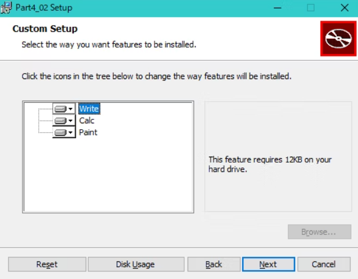

# Wix3.6: A Developer's Guide to Windows Installer XML

## 1: Getting Started

### Visual StudioのWixExtension(Votive)の設定

- Visual StudioにC#でCustomActionが作れるTemplateがある
- VSのプロジェクトのPropertiesで警告レベルをPedantic(細部まで過度にこだわる)にすると、細かな警告・エラーまで出力される
- Verbose output(冗長な出力)にチェックを入れると、多くの情報が得られる
- ICEはInternal Consistency EvaluationでWindowsInstallerがMSIをテストするテストケース(a suite of tests)
- VSのプロジェクトPropertiesでICE(MSIをテストするテストケース)を抑制することができる
- PropertiesでCompiler(Candle.exe)やLinker(Light.exe)にコマンドラインフラグを追加することができる

### GUIDについて

- GUIDはインストールするProductの参照をWindows Registryに格納するために使われる(ファイルの名前が衝突しても問題ないように)
- VisualStdioのToolからGUIDの生成ができて、レジストリ形式のものを利用すればOK(中カッコがついていても問題ない)

### Your First Wix Project

#### Productタグについて

- `<Product>`に書かれている内容は、MSIファイルの右クリックの`プロパティ -> Summaryタブ`から見ることができる
  - `Version`の値以外で、この情報は次回のソフトウエアの更新以降でも同じにしておく
- `<Product>`の`Id`は`ProductCode`と呼ばれ、WindowsがソフトウエアをUniqueとして認識する
  - `*`で設定にすると、コンパイル時に新しいGUIDを作ってくれる
- `Name`属性はMSIファイルのプロパティ以外にも、InstallerのUIの様々なところで利用される
- `Language`属性は、UIやエラーメッセージで利用する言語で、`1033`は英語(米国)で、それ以外の言語を使い場合は、`Language`と`CodePage`属性の両方を設定する必要がある
- **`Version`属性の4桁目は、以前バージョンを発見する際は、Wixは認識しないので注意する**
- `UpgradeCode`は`ProductCode`や`Version`が異なっていても、同じ製品であれば一定にする
  - Windowsは`UpgradeCode`でマシンにインストールされているソフトウエアを追いかける

#### Packageタグについて

- `<Packege>`で絶対必要な属性は`Compressed`で`yes`にするとMSIのリソースをCABファイルにする
- `Id`も必要だが、省略することでWixが自動で付与してくれるので気にしない
- `<Product>`は自分のソフトウエア(xxx.exe)について記述するが、`<Package>`はインストーラー自身(yyy.msi)を記述する野に利用する
  - msiを右クリックのPropertiesで見るとその内容を確認できる
  - `<Package>`の`Manufacturer, Description, Keywords, Comments`はそんなに必須じゃない印象
  - `Manufacturer`はPropertiesのAuthorで表示、`Description`はSubjectで表示、`Keywords`はKeywordsで表示、`Comments`はCommentsで表示される
- `InstallerVersion`は`msiexec.exe`(Windowsインストーラー本体)の特定のバージョンを指定する
  - Windowsインストーラーのメジャーバージョンに100倍してマイナーバージョンを足すと指定できる
  - Windowsインストーラーが4.5の場合は、405を指定する(msiexecで検索するとWindowsインストーラーのバージョンが確認できる)
- `InstallScope`で`perUser`を設定すると、現在のユーザーにインストールするが、WixのPropertyの`ALLUSERS`が設定されている(？)(Propetyを説明するときに解説する)

#### MediaTemplate/Mediaタグについて

- インストールする製品ソフトウエアはCABファイルとして圧縮され、MSIに埋め込むかどうか決めることができる
  - `<MediaTemplate EmbedCab="yes" />`で、MSIにCABファイルを埋め込むことができる(最大200MB)
  - `MaximumUncompressedMediaSize`属性で最大サイズを変更することができる
  - もし1つのファイルが最大よりも大きい場合、十分なスペースで格納できるCABファイルに格納される(？)
- もし複数の物理ディスクでインストールする場合は、`<Media>`を利用する
 - `<Media>`のまとめは割愛する(p22を読むこと)


#### Directoryタグについて

##### WindowsInstallerが定義済みのDirectoryプロパティ

 | Directoryプロパティ | パス |
 | :--- | :--- |
 | AddminToolsFolder | 管理者権限ツールがあるパス |
 | AppDataFolder | 現在のユーザーのroamingフォルダ |
 | CommonAppDataFolder | 全ユーザーのApplication data (C:\ProgramData) |
 | CommonFiles64Folder | 64bitのCommon Filesフォルダー |
 | CommonFilesFolder | 現在のユーザーのCommon Filesフォルダー |
 | DesktopFolder | デスクトップ |
 | FavoritesFolder | 現在のユーザーのお気に入りフォルダ |
 | FontsFolder | Fontsフォルダ |
 | LocalAppDataFolder | Localフォルダ |
 | MyPicturesFolder | Picturesフォルダ |
 | NetHoodFolder | NetHoodフォルダ |
 | PersonalFolder | 現在のユーザーのDocumentフォルダ |
 | ProgramFiles64Folder | 64bitのProgramFiles |
 | ProgramFilesFolder | 32bitのProgramFiles |
 | ProgramMenuFolder | Program Menuフォルダ |
 | RecentFolder | Recentフォルダ |
 | SendToFolder | 現在のユーザーのSendToフォルダ |
 | StartMenuFolder | StartMenuフォルダ |
 | StartupFolder | StartUpフォルダ |
 | System16Folder | 16bitのSystem Dllのフォルダ |
 | System64Folder | System64 フォルダ |
 | SystemFolder | 現在のユーザーのSystemフォルダ |
 | TempFolder | Tempフォルダ |
 | TemplateFolder | 現在のユーザーのTemplateフォルダ |
 | WindowsFolder | Windowsフォルダ |

※ MSDNでも確認できる

- 必ず`<Directory>`のRootのIdは`TARGETDIR`、Nameは`SourceDir`とする必要があり、すべての`<Directory>`はこの`TARGETDIR`の子供とする
- `<Directory>`の`Id`は、定義済みのId以外であれば、任意の値で問題ない
- `Name`はフォルダの名前になるので、記載すること(記載がなければ、親のフォルダにソフトウエアがインストールされる)
  - 定義済みのフォルダであれば、`Name`は不要


#### Componentタグ

- WindowsInstallerは、インストールするどんなファイルでもComponentにWrappされていないといけない
- ComponentはGUIDが必要でWindowsが追跡することができる(レジストリに登録されているので、ちゃんとUninstallができる)
- `<Component>`の`Id`に`CMP_xxx`とCMPをつけるのはおすすめ
- `KeyPath`を`Yes`にした`<File>`を1つは`<Component>`に書かないとだめ
  - KeyPathがyesのファイルだけ、修復の時に置き換えられるので、Componentに複数のFileを置くことはお勧めしない(p28)
  - すべてのファイルが修復対象であれば、Componentを分けないといけない(p28)
  - **(注)Windows11であれば、KeyPathが入ってないFileもちゃんと復元で元に戻る**
- **`<Component>`の中身が`File`だけなら、`<Component>`の`KeyPath=yes`でも問題なく動く**
  - **一方、`ProgramMenuFolder`にショートカットを置く場合は、`RegistryKeyのKeyPath`が必要**

#### Fileタグ

- `<File>`のIDは`FILE_`のHeaderをつけるとわかりやすい
  - IDはオプションなので書かなくても自動でファイル名と同じ名前でIDが割り振られる
- `Name`属性もオプションなので、名前を意図的に書き換えるのであれば書くこと
  - 書かなくても、`Source`と同じ名前がインストールされる
- `KeyPath`はつける必要があるが、ファイルがなくなり、修復されるときにKeyPathがyesのファイルだけが復元される(？)
  - **(注)Windows11であれば、KeyPathが入ってないFileもちゃんと復元で元に戻る**
  - `<Component>`の内側に1つの`KeyPath`が`yes`になった`File`が必要
  - もし`KeyPath`がSetされていない場合は、自動的に先頭の`<File>`が`KeyPath=yes`に設定される

#### Featureタグ

- `Feature`はユーザーが一度にすべてインストールするComponentのグループ
- `Feature`はインストールするときのFeatureTreeとして表示される
 
  - この場合は、`Title`にWriteとCalcとPaintの`<Feature>`がある

```XML
<Feature Id="FEATURE_Write" Title="Write">...</Feature>
<Feature Id="FEATURE_Calc" Title="Calc">...</Feature>
<Feature Id="FEATURE_Paint" Title="Paint">...</Feature>
```

- すべてのComponentはFeatureに含まれないといけない
- 特にオプション的なファイルがなければ、1つのFeatureにすべてのComponentをまとめても問題ない
- `<Feature>`の`Level=1`はデフォルトでインストールプロセスでそのFeatureが含まれることを示す
  - `Level=0`の場合は、feature treeから除外され、ユーザーもFeature Tree Dialogからインストールできなくなる
  - とにかく、特に気にしないのであれば`Level=1`にすべきかな？
- `<Feature>`を入れ子にすることで、Feature Tree Dialogで階層構造をつくることができる
- `<Feature>`の`Absent=disallo`でユーザーがDialogで除外できなくできる
- `Description`の属性を設定できるが、これはDialogで表示されるもの

#### Start menu Shortcuts

- `<Shortcut>`はUniqueなIDを持ち、`Name`は表示される名前を指定、`Description`はマウスホバーをしたときに表示される
- `Target`はユーザーのマシンで実際のファイルの場所を指定する
  - `[MyProgramDir]`はDirectoryのIDで指定できるパスのプロパティで`\`を含んでいるので、その先のファイル名はそのまま連結して問題ない(`[MyProgramDir]InstallMe.txt`)
- Shortcutを使う際は、`<RemoveFolder>`と`<RegistryValue>`が必要
  - `<RemoveFolder>`はStartMenuのサブDirectoryをアンインストール時に消す
    - `Id`はUniqueである必要がある
    - `On`属性でいつ消すかを指定する(`install`か`uninstall`か`both`)
    - `Directory`属性で、どのディレクトリを削除するか、そのIdで指定することができるが、ない場合は`<RemoveFolder>`の親のDirectoryかComponentGroupが自動で設定される
  - `<RegistryValue>`はすべての`<Component>`には`Keypath`が必要なので、それを設定するために`<RegistryValue>`を利用する(`<Shortcut>`は`Keypath`が設定できない)
    - このタグによってレジストリに登録され、Keypathも登録できる
    - ここで設定したRegistryの値は、ほかの目的では使わない
    - ほかの理由として、ShortCutは現在のユーザーの特定のディレクトリに生成するので、Windows Installerは複数ユーザがインストールしているときに、あるユーザーのUninstallを特定するために、RegistryKeyのKeyPathを利用する
- UninstallのShortCutを作る際は、同様に`<Shortcut>`を利用するが、その`Target`には`System`フォルダ(64bitなら`System64Folder`)にある、`msiexec.exe`を指定する
  - `msiexec.exe`は`\x [ProductCode]`の引数でUninstallを実行できる([ProductCode]はProductタグのIdのこと) 
    - この時、ProductのIdをじかに書かず`[ProductCode]`のプロパティで取得すること

#### ここまでのProduct.wxs

```XML
<?xml version="1.0" encoding="UTF-8"?>
<Wix xmlns="http://schemas.microsoft.com/wix/2006/wi">
  <Product Id="*" Name="Awesome Software"
           Language="1033" Version="1.0.0.0" Manufacturer="Awesome Company"
           UpgradeCode="{E30268F9-F258-4696-9A99-225AF0D7AAE1}">
    <Package InstallerVersion="301" Compressed="yes" InstallScope="perMachine"
             Manufacturer="Awesome Company" Description="Installes Awesome Software"
             Keywords="Practie, Installer, MSI" Comments="(c)2012 Awesome Company"/>
    <MediaTemplate EmbedCab="yes"/>

    <Directory Id="TARGETDIR" Name="SourceDir">
      
      <Directory Id="ProgramFiles64Folder">
        <Directory Id="MyProgramDir" Name="Install Practice" />
      </Directory>

      <Directory Id="ProgramMenuFolder">
        <Directory Id="MyShortcutsDir" Name="Awesome Software"/>
      </Directory>

    </Directory>
    
    <DirectoryRef Id="MyProgramDir">
      <Component Id="CMP_InstallMeTXT" Guid="{33055D38-14BB-45B0-A138-6A94A60E6E85}">
        <File Source="InstallMe.txt" KeyPath="yes"/>
        <File Name="InstallMeClone.txt" Source="InstallMe.txt"/>
      </Component>
    </DirectoryRef>
    
    <DirectoryRef Id="MyShortcutsDir">
      <Component Id="CMP_DocumentationShortcut" Guid="{8DAB1F40-851D-410B-AB61-44C2FFE99A77}">
        <Shortcut Id="DocumentationStartMenuShortcut" Name="Awesome Software Documentation"
                  Description="Read Awesome Software Documentation"
                  Target="[MyProgramDir]InstallMe.txt" />
        <Shortcut Id="UninstallShortcut" Name="Uninstall Awesome Software"
                  Description="Uninstall Awesome Software and all of its components"
                  Target="[System64Folder]msiexec.exe" 
                  Arguments="/x [ProductCode]"/>
        <RemoveFolder Id="RemoveMyShortcutsDir" On="uninstall"/>
        <RegistryValue Root="HKCU" Key="Software\Microsoft\AwesomeSoftware"
                       Name="installed" Type="integer" Value="1" KeyPath="yes" />
      
      </Component>
    </DirectoryRef>

    <Feature Id="MainProduct" Title="YM Main Product" Level="1">
      <ComponentRef Id="CMP_InstallMeTXT"/>
      <ComponentRef Id="CMP_DocumentationShortcut"/>
    </Feature>  

  </Product>
</Wix>
```

#### UIを追加

- WixのUIを追加するには`ProgramFiles(x86)\bin\WixUIExtension.dll`をプロジェクトの参照に追加する
- `<UIRef Id="WixUI_Minimal/>`は`<Product>`の内側であればどこに配置しても問題ない 

#### MSI databaseを確認する

- MSIの中身を確認するためには、MSI Viewerの`Orca.exe`が必要
  - VisualStudioをインストールしたときに、WindowsSDKも入ってるはずなので、`C:\Program Files (x86)\Windows Kits\10\bin\10.0.22621.0\x86\Orca-x86_en-us.msi`があるので、このMSIからインストール
  - 編集もできてしまうが、基本的にはXMLで編集して、中身の確認で`Orca`を利用するのがよさそう

#### インストール時のログを取得

- コマンドラインで、`/l*v ファイル名.txt`とする
  - `msiexec /i xxxx.msi /l*v yamakawa_log.txt`
- このログ出力は、インストール中に発生するすべてのイベントを記録する
- Uninstall時も働く(`/i`を`/x`に変更するだけ)
- もし途中でインストールが失敗した場合は、Logの`return value 3`(失敗を示す)の箇所を確認する
- MSIのエラーコードも確認すること

## 2: Creating Files and Directories

- プロジェクトのPropertiesのBuildで`Define Preprocessor variables`のところで、変数が定義でき、`$(var.変数名)`でアクセスできる
- ほかのWixプロジェクトを参照として追加したときに、そのプロジェクトの変数にアクセスするには`$(var.ProjectName.VariableName)`でアクセスできる
- (この本では)1つのComponentに複数のFileを加えることはBad Practiceというが、なんやかんや動くし、Repairも正常に動く@Windows11
- `<DirectoryRef>`は`<Directory>`にIdを対応させる必要がある
- `<ComponentGroup>`は`<Component>`をまとめて、1つの要素の参照でほかに利用できるようにする
- `<ComponentGroupRef>`は`<ComponentRef>`をまとめることができるので、`<Fragment>`に追加するときに楽に指定できる
  - `<ComponentGroup>`は`<File>`と`<Component>`を1対1にする場合には扱いが楽になるかも

```XML
<Feature>
  <!-- <ComponentGroup Id=...>とすると、<ComponentGroupRef>で一気にFeatureにまとめてかける -->
  <ComponentGroupRef Id="MyComponentGroup"/>
</Feature>

<!-- Productの内側ならどこでもOK -->
<!-- DirectoryやDirectoryRefにComponentがなくなるが、Directory属性で指定すればOK -->
<ComponentGroup Id="MyComponentGroup" Directory="DirectoryのID">
  <Component ...>
    <File ... />
  </Component>
  <Component ...>
    <File ... />
  </Component>
</ComponentGroup>

もしくは以下でもOK
<DirectoryRef Id="DirectoryのID">
  <Component Id="CMP_xxxx">
    ...
  </Component>
  <Component Id="CMP_yyyy">
    ...
  </Component>
</DirectoryRef>

<ComponentGroup Id="MyCOmponentGroup">
  <ComponentRef Id="CMP_xxxx" />
  <ComponentRef Id="CMP_yyyy" />
</ComponentGroup>
```

- `<Fragment>`はどのような要素でもその内側に入れれるので、ファイルを分けるのに有効
- `<ComponentGroupRef>`で`<ComponentGroup>`内にある全ての`<Component>`を一気に`<Feature>`に参照することができる
- `<Property>`はデータを格納するために使う変数で、`<Fragment>`の中に格納することができる
  - `<PropertyRef>`で`<Property>`とそれにつながるすべての`<Fragment>`内の要素を参照することができる(？)
- 1つのファイルに複数の`<Fragment>`を記述できる
- `<Fragment>`にファイルを分ける仕組みを利用して、`.wixlib`プロジェクトを作りwixlibライブラリとしてコンパイルすることができる
  - `.wixlib`をメインのWixプロジェクトに参照して、開発を分けることができる