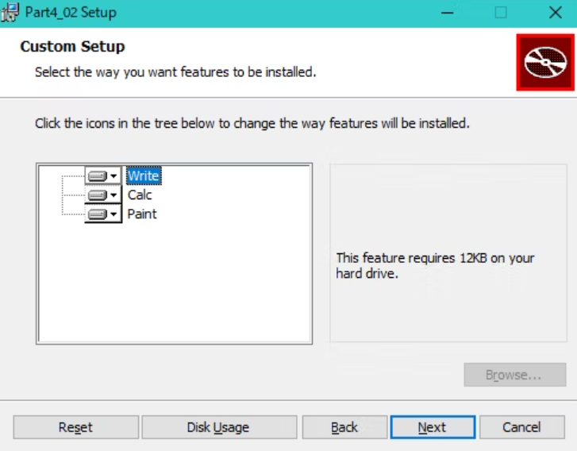

# Wix3.6: A Developer's Guide to Windows Installer XML

## 1: Getting Started

### Visual StudioのWixExtension(Votive)の設定

- Visual StudioにC#でCustomActionが作れるTemplateがある
- VSのプロジェクトのPropertiesで警告レベルをPedantic(細部まで過度にこだわる)にすると、細かな警告・エラーまで出力される
- Verbose output(冗長な出力)にチェックを入れると、多くの情報が得られる
- ICEはInternal Consistency EvaluationでWindowsInstallerがMSIをテストするテストケース(a suite of tests)
- VSのプロジェクトPropertiesでICE(MSIをテストするテストケース)を抑制することができる
- PropertiesでCompiler(Candle.exe)やLinker(Light.exe)にコマンドラインフラグを追加することができる

### GUIDについて

- GUIDはインストールするProductの参照をWindows Registryに格納するために使われる(ファイルの名前が衝突しても問題ないように)
- VisualStdioのToolからGUIDの生成ができて、レジストリ形式のものを利用すればOK(中カッコがついていても問題ない)

### Your First Wix Project

#### Productタグについて

- `<Product>`に書かれている内容は、MSIファイルの右クリックの`プロパティ -> Summaryタブ`から見ることができる
  - `Version`の値以外で、この情報は次回のソフトウエアの更新以降でも同じにしておく
- `<Product>`の`Id`は`ProductCode`と呼ばれ、WindowsがソフトウエアをUniqueとして認識する
  - `*`で設定にすると、コンパイル時に新しいGUIDを作ってくれる
- `Name`属性はMSIファイルのプロパティ以外にも、InstallerのUIの様々なところで利用される
- `Language`属性は、UIやエラーメッセージで利用する言語で、`1033`は英語(米国)で、それ以外の言語を使い場合は、`Language`と`CodePage`属性の両方を設定する必要がある
- **`Version`属性の4桁目は、以前バージョンを発見する際は、Wixは認識しないので注意する**
- `UpgradeCode`は`ProductCode`や`Version`が異なっていても、同じ製品であれば一定にする
  - Windowsは`UpgradeCode`でマシンにインストールされているソフトウエアを追いかける

#### Packageタグについて

- `<Packege>`で絶対必要な属性は`Compressed`で`yes`にするとMSIのリソースをCABファイルにする
- `Id`も必要だが、省略することでWixが自動で付与してくれるので気にしない
- `<Product>`は自分のソフトウエア(xxx.exe)について記述するが、`<Package>`はインストーラー自身(yyy.msi)を記述する野に利用する
  - msiを右クリックのPropertiesで見るとその内容を確認できる
  - `<Package>`の`Manufacturer, Description, Keywords, Comments`はそんなに必須じゃない印象
  - `Manufacturer`はPropertiesのAuthorで表示、`Description`はSubjectで表示、`Keywords`はKeywordsで表示、`Comments`はCommentsで表示される
- `InstallerVersion`は`msiexec.exe`(Windowsインストーラー本体)の特定のバージョンを指定する
  - Windowsインストーラーのメジャーバージョンに100倍してマイナーバージョンを足すと指定できる
  - Windowsインストーラーが4.5の場合は、405を指定する(msiexecで検索するとWindowsインストーラーのバージョンが確認できる)
- `InstallScope`で`perUser`を設定すると、現在のユーザーにインストールするが、WixのPropertyの`ALLUSERS`が設定されている(？)(Propetyを説明するときに解説する)

#### MediaTemplate/Mediaタグについて

- インストールする製品ソフトウエアはCABファイルとして圧縮され、MSIに埋め込むかどうか決めることができる
  - `<MediaTemplate EmbedCab="yes" />`で、MSIにCABファイルを埋め込むことができる(最大200MB)
  - `MaximumUncompressedMediaSize`属性で最大サイズを変更することができる
  - もし1つのファイルが最大よりも大きい場合、十分なスペースで格納できるCABファイルに格納される(？)
- もし複数の物理ディスクでインストールする場合は、`<Media>`を利用する
 - `<Media>`のまとめは割愛する(p22を読むこと)


#### Directoryタグについて

##### WindowsInstallerが定義済みのDirectoryプロパティ

 | Directoryプロパティ | パス |
 | :--- | :--- |
 | AddminToolsFolder | 管理者権限ツールがあるパス |
 | AppDataFolder | 現在のユーザーのroamingフォルダ |
 | CommonAppDataFolder | 全ユーザーのApplication data (C:\ProgramData) |
 | CommonFiles64Folder | 64bitのCommon Filesフォルダー |
 | CommonFilesFolder | 現在のユーザーのCommon Filesフォルダー |
 | DesktopFolder | デスクトップ |
 | FavoritesFolder | 現在のユーザーのお気に入りフォルダ |
 | FontsFolder | Fontsフォルダ |
 | LocalAppDataFolder | Localフォルダ |
 | MyPicturesFolder | Picturesフォルダ |
 | NetHoodFolder | NetHoodフォルダ |
 | PersonalFolder | 現在のユーザーのDocumentフォルダ |
 | ProgramFiles64Folder | 64bitのProgramFiles |
 | ProgramFilesFolder | 32bitのProgramFiles |
 | ProgramMenuFolder | Program Menuフォルダ |
 | RecentFolder | Recentフォルダ |
 | SendToFolder | 現在のユーザーのSendToフォルダ |
 | StartMenuFolder | StartMenuフォルダ |
 | StartupFolder | StartUpフォルダ |
 | System16Folder | 16bitのSystem Dllのフォルダ |
 | System64Folder | System64 フォルダ |
 | SystemFolder | 現在のユーザーのSystemフォルダ |
 | TempFolder | Tempフォルダ |
 | TemplateFolder | 現在のユーザーのTemplateフォルダ |
 | WindowsFolder | Windowsフォルダ |

※ MSDNでも確認できる

- 必ず`<Directory>`のRootのIdは`TARGETDIR`、Nameは`SourceDir`とする必要があり、すべての`<Directory>`はこの`TARGETDIR`の子供とする
- `<Directory>`の`Id`は、定義済みのId以外であれば、任意の値で問題ない
- `Name`はフォルダの名前になるので、記載すること(記載がなければ、親のフォルダにソフトウエアがインストールされる)
  - 定義済みのフォルダであれば、`Name`は不要


#### Componentタグ

- WindowsInstallerは、インストールするどんなファイルでもComponentにWrappされていないといけない
- ComponentはGUIDが必要でWindowsが追跡することができる(レジストリに登録されているので、ちゃんとUninstallができる)
- `<Component>`の`Id`に`CMP_xxx`とCMPをつけるのはおすすめ
- `KeyPath`を`Yes`にした`<File>`を1つは`<Component>`に書かないとだめ
  - KeyPathがyesのファイルだけ、修復の時に置き換えられるので、Componentに複数のFileを置くことはお勧めしない(p28)
  - すべてのファイルが修復対象であれば、Componentを分けないといけない(p28)
  - **(注)Windows11であれば、KeyPathが入ってないFileもちゃんと復元で元に戻る**
- **`<Component>`の中身が`File`だけなら、`<Component>`の`KeyPath=yes`でも問題なく動く**
  - **一方、`ProgramMenuFolder`にショートカットを置く場合は、`RegistryKeyのKeyPath`が必要**

#### Fileタグ

- `<File>`のIDは`FILE_`のHeaderをつけるとわかりやすい
  - IDはオプションなので書かなくても自動でファイル名と同じ名前でIDが割り振られる
- `Name`属性もオプションなので、名前を意図的に書き換えるのであれば書くこと
  - 書かなくても、`Source`と同じ名前がインストールされる
- `KeyPath`はつける必要があるが、ファイルがなくなり、修復されるときにKeyPathがyesのファイルだけが復元される(？)
  - **(注)Windows11であれば、KeyPathが入ってないFileもちゃんと復元で元に戻る**
  - `<Component>`の内側に1つの`KeyPath`が`yes`になった`File`が必要
  - もし`KeyPath`がSetされていない場合は、自動的に先頭の`<File>`が`KeyPath=yes`に設定される

#### Featureタグ

- `Feature`はユーザーが一度にすべてインストールするComponentのグループ
- `Feature`はインストールするときのFeatureTreeとして表示される
 
  - この場合は、`Title`にWriteとCalcとPaintの`<Feature>`がある

```XML
<Feature Id="FEATURE_Write" Title="Write">...</Feature>
<Feature Id="FEATURE_Calc" Title="Calc">...</Feature>
<Feature Id="FEATURE_Paint" Title="Paint">...</Feature>
```

- すべてのComponentはFeatureに含まれないといけない
- 特にオプション的なファイルがなければ、1つのFeatureにすべてのComponentをまとめても問題ない
- `<Feature>`の`Level=1`はデフォルトでインストールプロセスでそのFeatureが含まれることを示す
  - `Level=0`の場合は、feature treeから除外され、ユーザーもFeature Tree Dialogからインストールできなくなる
  - とにかく、特に気にしないのであれば`Level=1`にすべきかな？
- `<Feature>`を入れ子にすることで、Feature Tree Dialogで階層構造をつくることができる
- `<Feature>`の`Absent=disallo`でユーザーがDialogで除外できなくできる
- `Description`の属性を設定できるが、これはDialogで表示されるもの

#### Start menu Shortcuts

- `<Shortcut>`はUniqueなIDを持ち、`Name`は表示される名前を指定、`Description`はマウスホバーをしたときに表示される
- `Target`はユーザーのマシンで実際のファイルの場所を指定する
  - `[MyProgramDir]`はDirectoryのIDで指定できるパスのプロパティで`\`を含んでいるので、その先のファイル名はそのまま連結して問題ない(`[MyProgramDir]InstallMe.txt`)
- Shortcutを使う際は、`<RemoveFolder>`と`<RegistryValue>`が必要
  - `<RemoveFolder>`はStartMenuのサブDirectoryをアンインストール時に消す
    - `Id`はUniqueである必要がある
    - `On`属性でいつ消すかを指定する(`install`か`uninstall`か`both`)
    - `Directory`属性で、どのディレクトリを削除するか、そのIdで指定することができるが、ない場合は`<RemoveFolder>`の親のDirectoryかComponentGroupが自動で設定される
  - `<RegistryValue>`はすべての`<Component>`には`Keypath`が必要なので、それを設定するために`<RegistryValue>`を利用する(`<Shortcut>`は`Keypath`が設定できない)
    - このタグによってレジストリに登録され、Keypathも登録できる
    - ここで設定したRegistryの値は、ほかの目的では使わない
    - ほかの理由として、ShortCutは現在のユーザーの特定のディレクトリに生成するので、Windows Installerは複数ユーザがインストールしているときに、あるユーザーのUninstallを特定するために、RegistryKeyのKeyPathを利用する
- UninstallのShortCutを作る際は、同様に`<Shortcut>`を利用するが、その`Target`には`System`フォルダ(64bitなら`System64Folder`)にある、`msiexec.exe`を指定する
  - `msiexec.exe`は`\x [ProductCode]`の引数でUninstallを実行できる([ProductCode]はProductタグのIdのこと) 
    - この時、ProductのIdをじかに書かず`[ProductCode]`のプロパティで取得すること

#### ここまでのProduct.wxs

```XML
<?xml version="1.0" encoding="UTF-8"?>
<Wix xmlns="http://schemas.microsoft.com/wix/2006/wi">
  <Product Id="*" Name="Awesome Software"
           Language="1033" Version="1.0.0.0" Manufacturer="Awesome Company"
           UpgradeCode="{E30268F9-F258-4696-9A99-225AF0D7AAE1}">
    <Package InstallerVersion="301" Compressed="yes" InstallScope="perMachine"
             Manufacturer="Awesome Company" Description="Installes Awesome Software"
             Keywords="Practie, Installer, MSI" Comments="(c)2012 Awesome Company"/>
    <MediaTemplate EmbedCab="yes"/>

    <Directory Id="TARGETDIR" Name="SourceDir">
      
      <Directory Id="ProgramFiles64Folder">
        <Directory Id="MyProgramDir" Name="Install Practice" />
      </Directory>

      <Directory Id="ProgramMenuFolder">
        <Directory Id="MyShortcutsDir" Name="Awesome Software"/>
      </Directory>

    </Directory>
    
    <DirectoryRef Id="MyProgramDir">
      <Component Id="CMP_InstallMeTXT" Guid="{33055D38-14BB-45B0-A138-6A94A60E6E85}">
        <File Source="InstallMe.txt" KeyPath="yes"/>
        <File Name="InstallMeClone.txt" Source="InstallMe.txt"/>
      </Component>
    </DirectoryRef>
    
    <DirectoryRef Id="MyShortcutsDir">
      <Component Id="CMP_DocumentationShortcut" Guid="{8DAB1F40-851D-410B-AB61-44C2FFE99A77}">
        <Shortcut Id="DocumentationStartMenuShortcut" Name="Awesome Software Documentation"
                  Description="Read Awesome Software Documentation"
                  Target="[MyProgramDir]InstallMe.txt" />
        <Shortcut Id="UninstallShortcut" Name="Uninstall Awesome Software"
                  Description="Uninstall Awesome Software and all of its components"
                  Target="[System64Folder]msiexec.exe" 
                  Arguments="/x [ProductCode]"/>
        <RemoveFolder Id="RemoveMyShortcutsDir" On="uninstall"/>
        <RegistryValue Root="HKCU" Key="Software\Microsoft\AwesomeSoftware"
                       Name="installed" Type="integer" Value="1" KeyPath="yes" />
      
      </Component>
    </DirectoryRef>

    <Feature Id="MainProduct" Title="YM Main Product" Level="1">
      <ComponentRef Id="CMP_InstallMeTXT"/>
      <ComponentRef Id="CMP_DocumentationShortcut"/>
    </Feature>  

  </Product>
</Wix>
```

#### UIを追加

- WixのUIを追加するには`ProgramFiles(x86)\bin\WixUIExtension.dll`をプロジェクトの参照に追加する
- `<UIRef Id="WixUI_Minimal/>`は`<Product>`の内側であればどこに配置しても問題ない 

#### MSI databaseを確認する

- MSIの中身を確認するためには、MSI Viewerの`Orca.exe`が必要
  - VisualStudioをインストールしたときに、WindowsSDKも入ってるはずなので、`C:\Program Files (x86)\Windows Kits\10\bin\10.0.22621.0\x86\Orca-x86_en-us.msi`があるので、このMSIからインストール
  - 編集もできてしまうが、基本的にはXMLで編集して、中身の確認で`Orca`を利用するのがよさそう

#### インストール時のログを取得

- コマンドラインで、`/l*v ファイル名.txt`とする
  - `msiexec /i xxxx.msi /l*v yamakawa_log.txt`
- このログ出力は、インストール中に発生するすべてのイベントを記録する
- Uninstall時も働く(`/i`を`/x`に変更するだけ)
- もし途中でインストールが失敗した場合は、Logの`return value 3`(失敗を示す)の箇所を確認する
- MSIのエラーコードも確認すること

## 2: Creating Files and Directories

- プロジェクトのPropertiesのBuildで`Define Preprocessor variables`のところで、変数が定義でき、`$(var.変数名)`でアクセスできる
- ほかのWixプロジェクトを参照として追加したときに、そのプロジェクトの変数にアクセスするには`$(var.ProjectName.VariableName)`でアクセスできる
- (この本では)1つのComponentに複数のFileを加えることはBad Practiceというが、なんやかんや動くし、Repairも正常に動く@Windows11
- `<DirectoryRef>`は`<Directory>`にIdを対応させる必要がある
- `<ComponentGroup>`は`<Component>`をまとめて、1つの要素の参照でほかに利用できるようにする
- `<ComponentGroupRef>`は`<ComponentRef>`をまとめることができるので、`<Fragment>`に追加するときに楽に指定できる
  - `<ComponentGroup>`は`<File>`と`<Component>`を1対1にする場合には扱いが楽になるかも

```XML
<Feature>
  <!-- <ComponentGroup Id=...>とすると、<ComponentGroupRef>で一気にFeatureにまとめてかける -->
  <ComponentGroupRef Id="MyComponentGroup"/>
</Feature>

<!-- Productの内側ならどこでもOK -->
<!-- DirectoryやDirectoryRefにComponentがなくなるが、Directory属性で指定すればOK -->
<ComponentGroup Id="MyComponentGroup" Directory="DirectoryのID">
  <Component ...>
    <File ... />
  </Component>
  <Component ...>
    <File ... />
  </Component>
</ComponentGroup>

もしくは以下でもOK
<DirectoryRef Id="DirectoryのID">
  <Component Id="CMP_xxxx">
    ...
  </Component>
  <Component Id="CMP_yyyy">
    ...
  </Component>
</DirectoryRef>

<ComponentGroup Id="MyCOmponentGroup">
  <ComponentRef Id="CMP_xxxx" />
  <ComponentRef Id="CMP_yyyy" />
</ComponentGroup>
```

- `<Fragment>`はどのような要素でもその内側に入れれるので、ファイルを分けるのに有効
- `<ComponentGroupRef>`で`<ComponentGroup>`内にある全ての`<Component>`を一気に`<Feature>`に参照することができる
- `<Property>`はデータを格納するために使う変数で、`<Fragment>`の中に格納することができる
  - `<PropertyRef>`で`<Property>`とそれにつながるすべての`<Fragment>`内の要素を参照することができる(？)
- 1つのファイルに複数の`<Fragment>`を記述できる
- `<Fragment>`にファイルを分ける仕組みを利用して、`.wixlib`プロジェクトを作りwixlibライブラリとしてコンパイルすることができる
  - `.wixlib`をメインのWixプロジェクトに参照して、開発を分けることができる

### heat.exeによる`<File><Component>`の自動生成

- `'C:\Program Files (x86)\WiX Toolset v3.14\bin\heat.exe' dir .\install\ -out .\heat_test.wxs`で自動で`<Fragment>`が生成される

出力例）

```XML
<?xml version="1.0" encoding="utf-8"?>
<Wix xmlns="http://schemas.microsoft.com/wix/2006/wi">
    <Fragment>
        <DirectoryRef Id="TARGETDIR">
            <Directory Id="dir66789DFE0EFD750E77B25D541B4C52DB" Name="install" />
        </DirectoryRef>
    </Fragment>
    <Fragment>
        <DirectoryRef Id="dir66789DFE0EFD750E77B25D541B4C52DB">
            <Component Id="cmp7DE93F745A2B64B7B44B749C8202064D" Guid="PUT-GUID-HERE">
                <File Id="fil2C375459EAA74005B18D832B8F520DEB" KeyPath="yes" Source="SourceDir\InstallMe.txt" />
            </Component>
        </DirectoryRef>
    </Fragment>
</Wix>
```

- 自動で`<Fragment>`は生成されるが、`<Directory>`は元のフォルダ名になっていたり、GUIDは再度入力しないとだめだし、微調整は必要
- `SourceDir`属性は、生成されたHeatFile.wxsファイルと同じディレクトリとなっている
- これらの微調整をなるべく少なくするためには、Heat.exeを実行する、引数を利用する
- `'C:\Program Files (x86)\WiX Toolset v3.14\bin\heat.exe' dir .\install\ -cg NewFilesGroup -gg -gl -sf -srd -var "var.MyDir" -out "./heat_test_2.wxs"`
  - 引数の意味は、p58参照

出力例)

```XML
<?xml version="1.0" encoding="utf-8"?>
<Wix xmlns="http://schemas.microsoft.com/wix/2006/wi">
    <Fragment>
        <DirectoryRef Id="TARGETDIR" />
    </Fragment>
    <Fragment>
        <ComponentGroup Id="NewFilesGroup">
            <Component Id="cmpC2767BD8E2CDB66B7B6D125DDDA8A566" Directory="TARGETDIR" Guid="{40CDB80E-219E-41F7-B55F-AD38DD944281}">
                <File Id="filA2432FDCF1B92D06E3429B18BA4C23AD" KeyPath="yes" Source="$(var.MyDir)\InstallMe.txt" />
            </Component>
        </ComponentGroup>
    </Fragment>
</Wix>
```

- heat.exeを利用するときは、-ggフラグを使ってGUIDを自動生成しよう

### Copying and moving files

- `<CopyFile>`で既存のファイルをコピーできたり、インストールするファイルを別のフォルダにコピーすることができる(p61,63)
- `<CopyFile>`の属性で、`Delete=yes`とすると、そこにあるファイルが削除され、新たに配置される(p64)

### そのほか

- x64のフォルダにファイルを配置するには、Wixの構成プロパティで`x64`にすればよい
  - 自動で`-arch x64`が入るので、WixプロジェクトのTool SettingsのCompilerパラメータに入力しなくてもよい(最新のWix3では)
- `<CreateFolder>`を`<Component>`の中に入れるとフォルダだけが生成される
- ファイルのPermissionをつけることができるが、`WixUtilExtension.dll`と`xmlns:util="http://schemas.microsoft.com/wix/UtilExtension"`をつける必要がある(詳細はp71)
- Installの速度を速める方法として、FileのIDをなるべく同じフォルダであれば、似たようにすると、MSIのデータベースで並び替えの時に順序が整列される
  - ex) Aフォルダに入れるファイルが、X.txtとY.txtとすると、IDをId="FILE_A_X_TXT", Id="FILE_B_Y_TXT"とすると、WixのDBが順番に並べるので、早くなる(単語を区別するのに、_(アンダーバー)を使ってもいいし、.(ピリオド)も使ってもいい)

## 3: Putting Properties and AppSearch to Work

- Propertyはインストールの際の一時データを格納できる変数
- `<Property>`は`<Product>`の内側であれば、どこでも書ける
  - Id、Value共にどのような文字でもOK、Valueを省略したらnullが入るが、nullだとコンパイル時にそのPropertyの存在が無視される
- `<Property>`の書き方は下記2通り可能
  - `<Property Id="MyProperty" Value="test" />`
  - `<Property Id="MyProperty">test</Property>`
- コマンドラインで、Propertyを宣言できるが、その際はすべて大文字でないといけない。大文字のプロパティは「Public」として扱われる
  - `msiexec /i myInstaller.msi PROPERTY="aaaa"`
- Propertyを参照できるWixの要素は以下のみ
  - `Control`: Text属性だけ参照できる
  - `ListItem`: Text属性だけ参照できる
  - `Dialog`: Title属性だけ参照できる
  - `Shortcut`: TargetとArgument, Description属性だけ参照できる
  - `Condition`: Message属性だけ参照できる
  - `RegistryValue`: NameとValue属性だけ参照できる
- Propertyを参照する際は、`[PropertyのId]`でアクセスできる
  - innerTextでプロパティを参照する場合は、鍵括弧[]は不要

```XML
<Property Id="myProperty" Value="0" />
<Condition Message="Value of myProperty is [myProperty]. Shold be 1">
  <![CDATA[Installed OR myProperty = "1"]]>
</Condition>

<!-- ConditionはMSI起動時にチェックされて、Falseの時に表示されて、インストールが中断される -->
<PRoperty Id="MyProperty" Value="5">
<Condition Message="Some Message if condition is false">
  <![CDATA[MyProperty > 3]]>
</Condition>
```

- この場合のInnerTextのPropertyの参照は鍵括弧[]は不要
- `Installed`はBuiltInのプロパティで、Productがすでにインストールされてるかどうか判定する 
- CDATAセクションを使えば、 < や & などのエスケープを省くことができる(`<![CDATA[ ... ]]>`で記述する)
- `<Fragment>`に`<Property>`を宣言して、それを`Product.wsx`で利用したい場合は、`<PropertyRef>`を利用する
- パスワードなどをPropertyに格納した場合は、log出力すると見えてしまうので、Propertyの`Hidden`属性で隠すことができる
  - MSIのDatabaseでは隠すことはできない
  - 代わりにUIを使ってユーザーに入力してもらったり、コマンドラインでパスワードを入力してもらうと、そのパスワードがDatabaseに残ることはない
- デフォルトのPropertyはPublicではないので、実行フェーズでPropertyを扱うにはPublicにする必要がある
  - PropertyをPublicにするには、Idをすべて大文字にする必要がある
  - `MY_PASSWARD`はPublic、`my_Passward`はPrivate
  - ダイアログからのユーザーの情報を集めて、それを実行フェーズで何かのアクションのために使いたいときには、PropertyはPublicでなければいけない(ユーザーの情報をレジストリに格納したい時など)
  - Privateプロパティは現在のセッションの間しか存続しない
- Propertyの値はWixがよろしく型を解釈してくれるが、小数点は数字として解釈されないので注意
  - その場合は、`""`を入れると、Stringの比較になって、小数点も比較できる

```XML
<Property Id="MyNum" Value="2.0" />
<!-- 2.0は1より大きいのに、False扱いになってメッセージが表示される -->
<Condition Message="MyNum must be > 1">
  <![CDATA[MyNum > 1]]>
</Condition>

<!-- ""を入れると、比較できるので、True扱いになってメッセージが表示されない -->
<Condition Message="MyNum must be > 1">
  <![CDATA[MyNum > "1"]]>
</Condition>

<!-- 大文字小文字を無視して、Stringを比較する場合は、～をつける -->
<Property Id="MyString" Value="sample string" />
<Condition Message="message if false">
  <![CDATA[MyString ~="SAMPLE STRING"]]>
</Condition>

<!-- プロパティ自身が定義されているかどうか確認する -->
<Condition Message="message if false">
  <![CDATA[MY_PROPERTY]]>
</Condition>

<!-- NOTを入れると、否定ができる(Installedは定義済みプロパティ(インストールされているかどうか)) -->
<!-- これ危険！インストールしちゃうと、アンインストールできなくなった！！ -->
<Condition Message="Installed">
  <![CDATA[NOT Installed]]>
</Condition>
```

- 定義済みプロパティ
  - Productタグが定義されたときに、暗黙的なプロパティ
    - `ProductCode` = ProductのId
    - `ProductName` = ProductのName
    - `ProductLanguage` = ProductのLanguage
    - `ProductVersion` = ProductのVersion
    - `Manufacture` = ProductのManufacture
    - `UpgradeCode` = ProductのUpgradeCode
  - `[ProductCode]`などでアクセス可能
  - Directories系も暗黙的なプロパティ(`ProgramFiles64Folder`など)
  - 自身で定義したDirectoryもPropertyとしてアクセスできる(Idでアクセス)
    - `<Shortcut Id="DocumentationStartMenuShortcut" Name="Awesome Yamakawa Software Documentation" Description="Read Awesome Yamakawa Software Documentation" Target="[MyProgramDir]InstallMe.txt" />`の`[MyProgramDir]`
- 明示的に定義が必要な、WindowsInstallerのBuilt-Inプロパティ
  - `ARPXXXXX(Add/Remove Programs)`は、「プログラムの追加と削除(プログラムと機能)」の時に表示される追加的な情報、Windows8以下で利用するものなので不要じゃないかと思う(p88)
  - `ALLUSER`という既定のプロパティがあるが、これはPackageで決められるので、知っておくだけにする
    - `1`はperMachine
    - `""`(空欄)はperUser
    - `2`はOSによって異なるので使わない(非推奨)
- Directoryの検索が可能

```XML
<Property Id="NPP_PATH">
  <DirectorySearch Path="C:\Program Files (x86)\Notepad++" Depth="0" AssignToProperty="yes" Id="NppFolderSearch" />
</Property>
```

- もしDirectoryが発見できれば、そのパスの値が、PropertyのValueとして代入される、見つからなければnull
- `AssignToProperty`でPropertyにSetするかどうか決める
- 検索するパスは、絶対パスを指定する
- `Depth`でどれぐらいSubFolderまで見るか設定できる
- `Path`を絶対パスにしないのであれば、Rootパス(CドライブやDドライブから、Depth分だけ探しに行く)
- `<DirectorySearch>`をネスとすることで、もう少し柔軟な相対パスで検索できる(p92)
- `DirectorySearch`の子供に`FileSearch`を入れるとファイルSearchができる

```XML
<Property Id="README_FILE">
  <DirectorySearch Path="C:\Program Files (x86)\Notepad++" Depth="0" AssignToProperty="no" Id="NppFolderSearch">
    <FileSearch Name="readme.txt" Id="readmeFileSearch" />
  </DirectorySearch>
</Property>
```

- ファイルが見つかれば、プロパティのValueとして、フルパスが格納される
- 注）不意に、`Path=" C:\Progra...."`と、スペースを間違って入れないでください。ファイルは見つからないし、不具合がどこかわからず苦労します
- File検索は、Subフォルダの再帰的な検索はできないので、適切なパスを指定して、`FileSeach`をすること
- `FileSearch`以外に、`ComponentSearch`でもファイルを探すことができる
  - `ComponentSearch`では、GUIDを使って、Keyパスが設定されているFileを検索する
- `RegistrySearch`でレジストリを検索できる
  - 見つかれば、そのレジストリの値が`<Property>`のValueに格納される
  - `RegistrySearch`で検索したレジストリの値が、ファイルパスで、そのパスにファイルがあるかどうか確認するときは、`FileSearch`も組み合わせればOK

```XML
<Property Id="MY_PROPERTY">
  <RegistrySearch Id="myRegSearch" Root="HKLM" Key="SOFTWARE\WIXTEST" Name="PathToFile" Type="file">
    <FileSearch Id="myFileSearch" Name="[MY_PROPERTY]" />
  </RegistrySearch>
</Property>
```

- プロパティのアクセスについて、基本的には`[XXX]`でアクセスだが、XMLのInnerTextでアクセスする場合は、`[]`は不要

## 4: Improving Control with Launch Conditions and Installed States

- Launch Conditionはインストールの初回で判定する事前条件で、不適合であればインストールが進まない
- Feature ConditionやComponent Conditionはそれぞれ`<Feature>`や`<Component>`の子供として記述でき、条件に不適合であれば、そのFeatureやComponentがインストールされない
- Launch Conditionは`<Product>`の間に入れたら判定されて、MSIのDBには、`LaunchCondition`として記述される
- Launch Conditionは、.NETのインストール状況をチェックしたり、管理者権限や、OSのバージョンなど、インストール以前の事前条件を判定できる
  - 条件が不適合であれば、インストールが進まない(falseの場合)
  - .NETのインストールの判断は、`WixNetFxExtension.dll`を追加する必要がある
    - .NETがインストールされているか判断するプロパティの一覧は、p110を見ること
    - .NETがインストールされているか判断するプロパティを利用する際は、`<PropertyRef>`で参照する必要がある。なぜなら、dll側で`<Fragment>`として定義されているので、明示的に参照する必要がある
- PpwerShellのバージョンを取るには、`WixPSExtension.dll`を参照して、`POWERSHELLVERSION`プロパティを利用する
- WindowsOSのバージョンを確認するには、`VersionNT`もしくは、64bitなら`VersionNT64`プロパティを利用すればよい。各Windowsのバージョンの値は、p111を参照
-  OSのServicePackのレベルを判定する場合は、`ServicePackLevel`を参照する
- 環境変数にアクセスする場合は、`%`をつけてアクセスする
- `<Fragment>`に`<Condition>`を記述するには、`<Property>`を別途定義する必要があり、`<Product>`側には、`<PropertyRef>`でそのPropertyを参照する
- Feature Conditionは`<Feature>`の内側に`<Condition>`を入れ、条件がTrueの場合にFeatureがインストールされている
  - UIでユーザーがインストールするFeatureをOFFにしたときに、FeatureConditionがFalseになり、インストールしないように制御できる

```XML
<Feature ... Level="1">
  <ComponentRef Id="xxxx" />
  <Condition Level="0">
    <![CDATA[MyProperty = "some value"]]>
  </Condition>
</Feature>
```

- このように、`MyProperty`がsome valueではなかったとき(false)、Levelが0に更新されて、このFeatureがインストールされなくなる
- feature conditionは、FileCostのアクションの間に評価される
- Levelを`INSTALLLEVEL`プロパティ(デフォルトは1)より高くすると、除外されずに非アクティブ状態になる
- `INSTALLLEVEL`は重要なプロパティでどのFeatureもこのプロパティと比較される。INSTALLLEVELと同じか0でなく小さい値であれば、Featureはアクティブ状態になる
- インストーラーで、「推奨」(Typical Install)や「完全インストール」(Full Install)というのがあれば、その選択で`INSTALLLEVEL`が100(Full)もしくは50(Typical)に設定されて、その値以下のFeatureがインストールされるようになっている
- Component ConditionはFeature Conditionととても似ているが、Componentのインストールの可否を決める
- `<Component>`の内側に`<Condition>`を入れるが、Levelの設定は不要

```XML
<Property Id="MyProperty" Value="1" />

<Component ....>
  <File ....>
  <Condition>MyProperty = 1</Condition>
</Component>
```

- この設定であれば、MyProperty=1の場合、ComponentがInstallされる
- Comoponent ConditionはFileやRegistryKeyやDirectoryなど個別に条件を設定できる
- Component Conditionは初回のインストールしか判断しないので、再インストールでも条件を再評価するには、`<Component>`に`Transitive="true"`が必要(p118)

- `<Feature>`の`Level`属性について
  - FeatureのActionStateとは、ユーザーがFeatureをインストールするかどうかを決める値が格納される
    - Unknown : Constingが実行されないからなどから、状態が未定義になって、どのアクションも起きない
    - Advertised : 宣伝通りにインストールされる
    - Absent : FeatureやComponentはインストールされない
    - Local : ローカルのハードディスクにインストールされる
    - Source : ネットワークなどのソースからFeatureやComponnentは実行される
  - ActionStateはCostingが実行されるまでに設定される。
  - Constingはハードドライブにどれぐらい余裕の容量が必要かを判断するプロセス(`CostFinalized`のイベント) 
  - Constingが終われば、特殊な構文でFeatureやComponentのActionStateが取得できる
  - アクションステートを取得したい場合は、Featureであればアンパサンド(&)を名前(ID?)の前につければよい。コンポーネントであればドルマーク($)をつければよい
    - `&MainFeature = 3`, `$ComponentA = 3`とする
    - 各数値の意味はp120を参照
  - `CostFinalized`のアクションの後に利用するのがよい
- Windowsインストーラーはインストールされているかどうか確認する際に、`install state`を使って確認する
  - FeatureであればIDに！をつけ、ComponentはIDに？をつけて、Install Stateを参照できる
  - `!MainFeature = 3`や`?ComponentA = 3`
  - 各数値の意味は、p121を参照
  - CustomActionの条件式で、ActionStateやInstalled Stateが利用できる

```XML
<Custom Action="MyCustomAction"...>
  <![CDATA[$ComponentA = 2 AND ?ComponentA = 3]]>
</Custom>
```

## 5: Understanding the Installation Sequence

### InstallUISequence

- InstallUISequenceはMSIのデータベースの名前でもあり、インストールの最初の半分の処理をさす
- このInstallUISequenceの間では、UIを起動し、ユーザーのコンピュータを変更しないタスクを実行する(例えば、AppSearchやConditionを起動する)
- InstallUISequenceでは下記の順番でActionが実行される
  - FindRelatedProducts(Sequence:25)
    - MSIのUpgradeというテーブルを見るAction。テーブルには、Upgrade CodeやVersionや言語が格納され、インストーラーは自身のソフトウエアの以前のバージョンを探す際の基準として利用する。以前のバージョンが見つかれば、WindowsInstallerのプロパティがProductCodeにセットされる。このプロパティは現在のインストールがUpgradeなのかDowngradeなのかを確認するために利用する
  - AppSearch(50)
    - AppSearchのActionはAppSearchテーブルを読みWixのMarkupで記載されている検索を実行する。(ファイルやディレクトリやレジストリキーを探すなど(p90のAppSearch))
  - LaunchConditons(100)
    - LaunchConditionのテーブルに記載の条件を確認・実行する
  - Validate ProductID(700)
    - エンドユーザーからソフトウエアのレジストリーキーを集めて、`PIDKEY`に格納する。このプロパティは、`PIDTemplate`と比較され、`PIDKEY`と一致するはず。`ProductID`がセットされる
  - CostInitialize(800)
    - インストールの際に、現在のマシンに余裕があるか計算する、Costing処理が実行される。この時、ComponentやFeatureテーブルがメモリーに展開されインストーラーがどのComponentやFeatureがインストールするかを確認するステージに移行する
  - FileCost(900)
    - インストーラーがコスト計算をスタートする。もしエンドユーザーのマシンに前回のインストールで入れた同じファイルがあったとしたら、ファイルバージョンが新しければ置き換えられることになる。
  - CostFinalize(1000)
    - ここでは、Cost計算はLevelの設定状況でインストールすべきでないComponentやFeatureのことを考慮する。全てのターゲットディレクトリが書き込み可かどうか確認する。このフェーズでConting処理が終了する
  - MigrateFeatureStates(1200)
    - もし以前のバージョンがインストールされていたら、このアクションはどのFeatureがインストールされているかをチェックし、そのFeatureのActionStateを現在のインストーラと同じStateに設定する。そうすることで、新しいInstallerは対応するFeatureをenabledかdisableかをFeatureTreeに表示できる。
  - ExecuteAction(1300)
    - 次に、InstallExecuteSequenceに制御を移す。このアクションで、管理者かユーザーかを設定する

### InstallExecuteSequence

- この過程で、ファイルを配置したり、レジストリを更新したり、「プログラムの機能と追加」で新しく追加したり、コンピュータを変化させるActionが実行される
- インストールのこのパートを「サーバーサイド」と言ったり、InstallUISequenceを「クライアントサイド」と言ったりする。
- もしインストールの際にLog出力をしていたとしたら、ログには、クライアントサイドの実行か、サーバーサイドの実行か明記されている

```
// (c)はクライアントサイド
MSI (c) .... : Switching to server:
// (s)はサーバーサイド
MSI (S) .... : Grabbed execution mutex.
// ↑ここで実行Mutexを取得しているので、この間は他のMISの実行はできない
```

- InstallExecuteSequence配下の順番で実行される(初めの6つはUIフェーズで実行されている場合はSkipされる)
  - AppSearch
  - LaunchConditions
  - ValidateProductId
  - ConstInitialize
  - FileCost
  - CostFinalize
  - InstallValidate
    - 十分なディスクスペースがあるか計算し、MSIによるインストールを妨害する起動アプリケーションがないかもチェックする
  - InstallInitialize
    - このActionは「deferred」状態を宣言する。このActionからInstallFinalizeまで、Transactionが実行されるがエラーが起きればRollbackする。これは、何かエラーが起きたら中途半端なインストール状態になるのを防ぐため
  - ProcessComponents
    - このActionではインストーラ内にあるComponentsのNoteを作り、レジストリにComponentsのGUIDを格納します。どのComponentがKeypathかも追跡します
  - UnpublishFeatures
    - Uninstall時に、このActionはレジストリ内のComponentとFeatureのマッピングを削除し、どのFeatureが選択されているかについての情報を破棄します
  - RemoveRegistryValues
    - Uninstall時に、このActionはMSIのレジストリーとRemoveRegistryテーブルを見に行き、削除すべきレジストリアイテムを見つけます
  - RemoveShortcuts
    - Uninstall時に、インストーラが生成したShortcutを削除します
  - RemoveFiles
    - Uninstall時に、このActionはシステムにコピーされたファイルやディレクトリを削除します。`<RemoveFolder>`や`<RemoveFile>`で指定したComponentも削除できます。これらのエレメントは、On属性で、installやbothを設定していると、ここでインストール時でも削除することができます。
  - InstallFiles
    - ディレクトリやファイルを適切な場所に配置します。以前のインストールからファイルが既に存在し、そのコンポーネント GUID とバージョンが変更されていない場合は、ファイルをそのまま残すことを認識するほどスマートです。
  - CreateShortcuts
    - ショートカットを作ります
  - WriteRegistyValues
    - Wix要素の`<RegistryKey>`や`<RegistryValue>`でレジストリーに書き込みます。
  - RegisterUser
    - どのユーザーがこのインストールを実行したかを登録します
  - RegisterProduct
    - 「プログラムの追加と削除」にProductを登録します。格納場所は`%WINDIR%\Installer`となります
  - PublishFeatures
    - このActionでは、インストール状態(Installed, advertised, absent)がレジストリに書き込まれ、ComponentがFeatureにマッピングされます
  - PublishProduct
    - Advertisedインストールの時しか使わないのだが、このActionは、一般ユーザーにたいして、オンデマンドのインストールが可能になる
  - InstallFinalize
    - このActionはいわゆるDeferred状態というRollbackで守られた状態の終わりを宣言します。ここを通過すれば、インストールは完了したことになります

- このようにUISequenceとExecuteSequenceを分けている理由
  - システムの変更を1つのフェーズ(InstallExecuteSequence)にまとめている理由は、WindowsInstallerがもしエラーが起きた時にRollbackの防御といった他のことを提供することができるから。
  - ロールバック防御がまだスタートしていないが、スクリプトが実行可能な、初期状態は実行フェーズのimmediateフェーズという
  - いったん処理が開始されたら、それはdeferredステージという。
    - もしエラーが起きれば、その点でRollbackアクションをするスクリプトを利用する
    - deferredステージにのみ、Rollback防御がある
    - UI Sequenceはこの特徴を持っていないので、巣ステムを変更するActionはそこでは絶対に起きない
- これからCustomActionを作っていくが、そのActionはDeferredActionになるように作ることに気を使うこと。そして、ExecuteフェーズのInstallInitializeとInstallFinalizeの間で実行するようにスケジュール設定をすること。また、自身でrollbackアクションも作る必要がある。

### CustomActionについて

- システムを変更する(ファイル変更、データベースのセットアップユーザー権限の設定など)Actionをしたい場合は、必ずExecuteSequenceのDeferredステージで発生させること
- それ以外なら、UISequenceでもExecuteSequenceでもどちらでも、Actionを定義してもよい
- CustomActionの書き方

```XML
<!-- Executeは実行方法を定義、ReturnはそのReturn状態はどのように扱われるべきかを定義 -->
<!-- この場合は、deferredステージで実行し、完了したときに成功かどうかチェックする -->
<CustomAction Id="MyAction" Execute="deferred" Return="check" ... />
```

- 以下の7つのタイプのカスタムアクションがある
  - Windows InstallerのPropertyをセットする
  - ディレクトリのLocationを設定する
  - VBScriptやJScriptのコードを実行する
  - 外部のVBScriptやJScriptのファイルを呼び出す
  - DLLからメソッドを呼び出す
  - 実行ファイルを実行する
  - インストールを止めるエラーを送信する
- ExecuteSequenceにCutomActionを追加するためには、`<InstallExecuteSequence>`と`<Custom>`が必要

```XML
<CustomAction Id="MyAction" Execute="deferred" Return="check" .../>

<InstallExecuteSequence>
  <!-- Action属性で、CustomActionのIDを指定、AfterでどのActionに後に実行するかを設定する、Beforeでも設定できる -->
  <!-- Sequence属性も設定できる。InstallExecuteSequenceテーブルのSequence列の数字を設定する -->
  <Custom Action="MyAction" After="InstallInitialize" />

  <!-- 自分のCustomActionの後にCustomActionも設定できる -->
  <Custom Action="MyAction2" After="MyAction" />
</InstallExecuteSequence>

<!-- ****************************** -->

<!-- UISequenceの設定方法 -->
<CustomAction Id="MyUIAction" Execute="immediate" Return="ignore" .../>

<InstallUISequence>
  <Custom Action="MyUIAction" After="CostFinalize" />
</InstallUISequence>
```

- Executeに設定できるよく使う値は、immediateとdeferred、rollback、commitだが、後半３つはExecuteSequenceで利用する。
  - commitを設定したときは、いったんインストールが完了したら実行される設定
  - もちろんUISequenceとExecuteSequenceの両方で同じCustomActionを設定することができるが、そのCustomActionを以下のExecute属性の設定で制御できる
    - firstSequenceを設定すると、1回だけ実行する
    - secondSequenceと設定すると、UISequenceで実行した場合にExecuteSequenceで実行される
- Return属性は、インストーラーに、カスタム アクションが処理を完了するまで待機してから続行するかどうか、および戻りコードを評価するかどうかを指示します。
  - asyncNoWait : CustomActionは非同期で実行され、インストーラーが終わったとしてもその実行は続く
  - asyncWait : CustomActionは非同期で実行されるが、インストーラーはその処理が終わって戻り値が車で待つ
  - check : CustomActionは同期的に実行され、戻りコードが成功かどうかチェックされます。これがデフォルトのふるまい
  - ignore : CustomActionは同期的に実行され、戻り値はチェックされない。
- deferredステージでは、もしCustomActionが失敗して、Return属性が、checkかasyncWaitであれば、ロールバックが発生し、そこからの全ての変更が元に戻される
- immediateフェースであれば、失敗すればその時点でインストールが終了する

#### CustomAction:1 WindowsInstallerのPropertyを設定する

- プロパティをCustomActionでセットできる

```XML
<CustomAction Id="rememberInstallDir" Property="ARPINSTALLLOCATION" Value="[XXXX]" />

<InstallExecuteSequence>
  <Custom Action="rememberInstallDir" After="InstallValidate" />
</InstallExecuteSequence>
```

- `<SetPropery>`を使うと、もっと気軽にPropertyをセットできる

```XML
<!-- Sequence属性でexecuteを設定すると、InstallExecuteSequenceと同じ設定となる -->
<SetProperty Id="MyProperty" Value="123" After="InstallInitialize" Sequence="execute" />
```

- この設定によって、SetMyPropertyというCustomActionが生成される。

#### CustomAction2: インストールするディレクトリの場所を設定できる

```XML
<!-- すでに<Directry>にIdをDataDirにしている前提 -->
<CustomAction Id="SetAppDataDir" Directory="DataDir" Value="[CommonAppDataFolder]MyProduct" />

<!-- ファイルをインストールする前にDirectoryの位置を決めないといけない -->
<InstallExecuteSequence>
   <Custom Action="SetAppDataDir" Before="InstallFiles" />
</InstallExecuteSequence>

<!-- これでもOK -->
<SetDirectory Id="DataDir" Value="[CommonAppDataFolder]MyProduct" Sequence="execute" />
```

- このActionが実行されると、`<Directory Id="DataDir">`になっているところの具体的な場所が、`[CommonAppDataFolder]MyProduct`になる

#### CustomAction3: VBScriptやJScriptのコードを実行する

- JScriptやVBScriptをCutomActionの中に埋め込むことができる

```XML
<!-- このアクションをScheduleすれば実行できる -->
<CustomAction Id="testVBScript" Script="vbscript" Execute="immediate">
  <![CDATA[
    <!-- ここにVBScriptを直で書くことができる -->
    msgbox "this is embedded code..."
    <!-- Session.PropertyでWixのプロパティにアクセスできる -->
    msgbox "MyProperty: " & Session.Property("MyProperty")
  ]]>
</CustomAction>
```

- しかし、公式としてはVBScriptを埋め込むとデバッグがしにくいので、デバッグしやすいC#やC++でやるほうがいい
- ちなみに、埋め込むVBScriptをxxx.vbsとファイルに分けることができる。この際Return 1にすると成功、return 3にすると失敗扱いになる
- VBのファイルを呼び出すためには、Wixで初めにBinary要素で宣言して、CustomActionのBinaryKeyにそのID、VBScriptCallで呼び出す関数を宣言する

```XML
<Binary Id="myScriptVBS" SourceFile=".\myScript.vbs"/>

<!-- 実行するにはScheduleするだけ -->
<CustomAction Id="myScript_CA" BinaryKey="myScriptVBS" VBScriptCall="myFunction" Execute="immediate" Return="check" />
```

#### DLLからメソッドを呼び出す

- WindowsInstallerは標準では.NETをサポートしておらずC/C++を利用するのだが、コンパイル時にC#をC++のDLLに変換している
- .NETのDLLを作成する場合は、インストールするユーザーのPCにも該当する.NET Frameworkがインストールしている必要がある
- .NET Frameworkに依存しないのであれば、C++のカスタムアクションのDLLを作ればよい
- `using Microsoft.Deployment.WindowsInstaller`でプロパティやFeatureやComponentにアクセスできる`Session`クラスを利用できる 
- `ActionResult`はカスタムアクションが成功したか失敗したかを記述する
- `[CustomAction]`と引数が`Session`であれば、クラス名やメソッド、ネームスペースは自由で問題ない
- 1つのDLLに記述できるカスタムアクションには上限がある
  - Wix3.6からは、128個が上限。もしそれ以上のCustomActionを作りたいのであれば、もう1つプロジェクトを作る必要がある
- コンパイルすると、`.dll`と`.CA.dll`が生成され、2つ目のDLLがWixプロジェクトで参照するものである。なぜならMSIが認識するunmanagedなコードを持っているから
- Wixプロジェクトが.NETのCustomActionを参照する方法は、Wixプロジェクトで「参照の追加」で参照するか、直接DLLを参照するかである
  - 直接参照する場合、参照パスで`.CA.dll`を直接参照しないといけない(`<Binary Id="myCustomActionDLL" SourceFile="./myCustomAction.CA.dll" />`)
  - 「プロジェクトの追加」で参照する場合、参照パス(`$(var.{ProjectName}.TargetDir`)を使って、`<Binary Id="myCustomActionDLL" SourceFile="$(var.myCustomActions.TargetDir)myCustomAction.CA.dll" />`を追加する必要がある
- そしてその.NETのCustomActionを実行するには、CustomActionを定義して、Sequenceに追加する必要がある

```XML
<!-- BinaryKeyは<Binary>で定義したdllのID、DLLEntryはC#のメソッド名 -->
<CustomAction id="CA_myCustomAction" BinaryKey="myCustomActionDLL" DLLEntry="myFunction" Execute="immediate" Return="check" />

<InstallUISequence>
  <Custom Action="CA_myCustomAction" After="CostFinalize" />
</InstallUISequence>
```

- CustomActionを作るために使ったScriptファイルやDLLはユーザーのPCにはインストールはされないし、MSIの中にパッケージされる

#### 実行ファイルを実行する